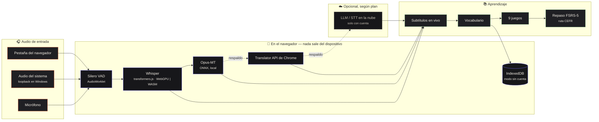

<div align="center">

# Babel Play

**Aprende un idioma con lo que ya ves, juegas y conversas.**
Transcripción y traducción en vivo de cualquier audio de tu computadora — ejecutándose **dentro del navegador** — convertidas en juegos de vocabulario y repetición espaciada.

[🇺🇸 English](README.md) · [🇧🇷 Português](README.pt-BR.md) · [🇨🇳 中文](README.zh-CN.md) · [🇫🇷 Français](README.fr.md) · [🇪🇸 Español](README.es.md)

[](https://github.com/GuilhermeLVL/babel-play/actions/workflows/ci.yml)
[](https://github.com/GuilhermeLVL/babel-play/actions/workflows/seguranca.yml)
[](LICENSE)


</div>

> **Demo:** llega con el despliegue público. Mientras tanto, ejecútalo localmente en tres comandos — sin clave de API.

## Pruébalo

```bash
npm install          # también copia los binarios de ONNX Runtime / Silero VAD a public/
cp .env.example .env # define PORT; no hace falta ninguna clave de API para el pipeline local
npm run dev          # → http://localhost:<PORT>   (abre vía localhost: contexto seguro para los modelos)
```

Elige **Continuar sin cuenta**: todo el pipeline corre localmente y **ni una sola petición** llega al servidor — está medido, no prometido.

## Qué hace

| | |
|---|---|
|  | **Inicio** — los tres frentes de la app (capturar, practicar, vocabulario) con el estado real de cada uno. Nivel, racha y seeds se derivan de eventos medidos, nunca se escriben a mano. |
|  | **Capturar** — una pestaña del navegador, el audio del sistema (loopback en Windows, sin configurar) o el micrófono. Whisper transcribe en el navegador (WebGPU, respaldo WASM); Opus-MT, la Translator API de Chrome o un LLM en la nube traducen, siempre con cadena de respaldo. Subtítulos flotantes sobre el video o el juego. |
|  | **Jugar** — nueve juegos cortos construidos con *tu* vocabulario (memoria, sopa de letras, deletreo, duelo relámpago…), con una ruta CEFR basada en listas reales. Lo que aciertas aquí cuenta en el repaso. |
|  | **Sin cuenta** — todo el pipeline local funciona sin registrarse; las pantallas que persisten datos muestran una invitación en vez de un muro, y lo hecho en el navegador migra a la cuenta, una sola vez, al registrarte. |

**La cuenta es opcional.** Sin ella, los datos viven en IndexedDB; al registrarte, migran una sola vez, de forma idempotente. Con cuenta, el plan lo decide el servidor (free: todo local/BYOK; pro: IA en la nube gestionada).

## Cómo funciona



- **Un solo embudo HTTP** (`apiFetch`): sin cuenta responde un servidor en memoria con las mismas formas que el servidor real; la UI no nota la diferencia.
- **Identidad · plan · rol** son ejes separados; el cliente solo *pinta* el plan, nunca lo decide.

Detalles en [docs/arquitetura.md](docs/arquitetura.md).

## Medido, no prometido

- **Modo sin cuenta: 0 peticiones a `/api`** en el flujo completo.
- **Contraste**: 0 nodos por debajo de WCAG AA en 14 combinaciones; 0 objetivos menores de 24 px.
- **Capacidad** (un proceso, 4 CPU): ~300 req/s; más workers *reducen* el rendimiento (SQLite tiene un único escritor).
- **Auth**: 7 vectores de token falsificado rechazados por el verificador real, y un control positivo aceptado.
- Más de 1.800 pruebas automatizadas en cada push.

## Lo que aún no funciona

- Opus-MT int8/fp16 falla en algunos dispositivos; cae al siguiente traductor, que puede no existir sin cuenta.
- El audio de pantalla compartida en Windows puede dar `NotReadableError`; usa pestaña o loopback.
- Las rondas jugadas sin cuenta no migran (sesiones, audio y tarjetas sí).
- Base de datos de un solo escritor: sirve para una beta, no para escalar.
- Sin cobro todavía — el plan lo define un admin.

## Verificar

```bash
npm run typecheck && npm run typecheck:core && npm run lint && npm test && npm run build
```

[Contribuir](CONTRIBUTING.md) · [Seguridad](SECURITY.md) · [MIT](LICENSE)
