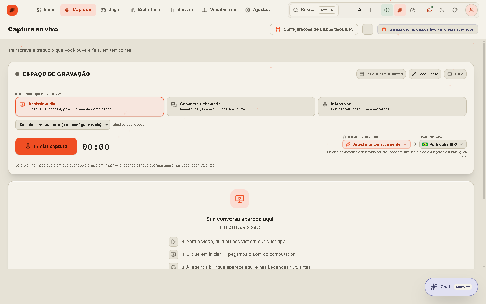
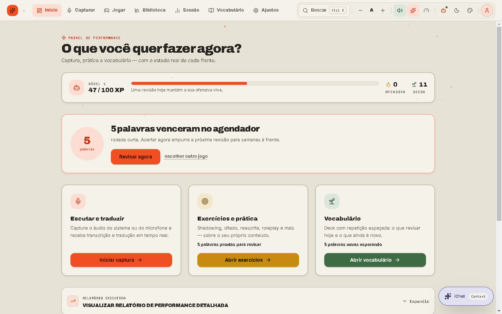
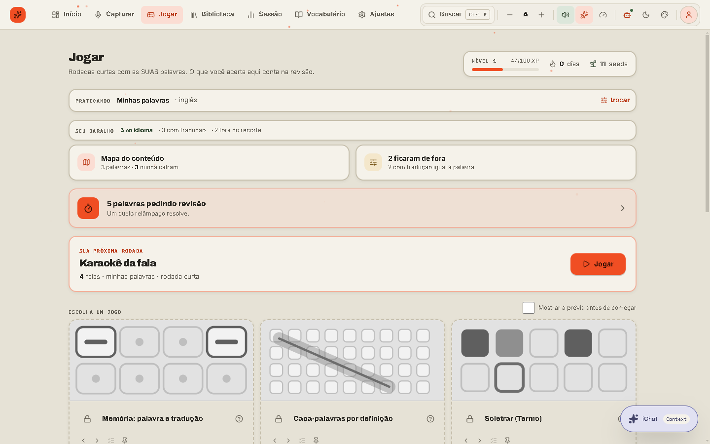
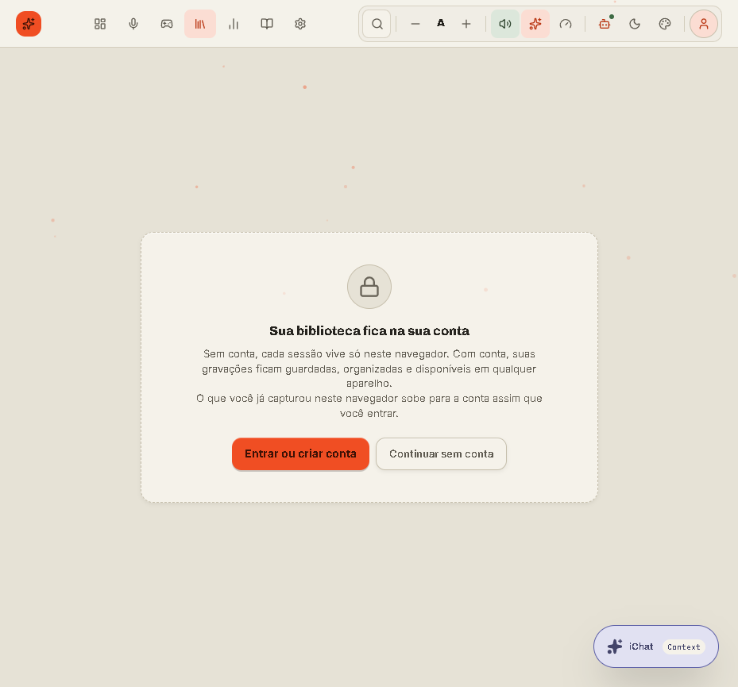
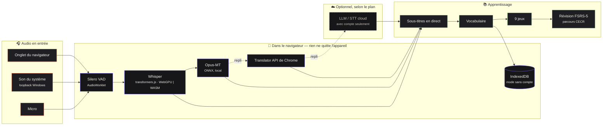

<div align="center">

# Babel Play

**Apprenez une langue avec ce que vous regardez, jouez et dites déjà.**
Transcription et traduction en direct de n'importe quel son de votre ordinateur — exécutées **dans le navigateur** — transformées en jeux de vocabulaire et en répétition espacée.

[🇺🇸 English](README.md) · [🇧🇷 Português](README.pt-BR.md) · [🇨🇳 中文](README.zh-CN.md) · [🇫🇷 Français](README.fr.md) · [🇪🇸 Español](README.es.md)

[](https://github.com/GuilhermeLVL/babel-play/actions/workflows/ci.yml)
[](https://github.com/GuilhermeLVL/babel-play/actions/workflows/seguranca.yml)
[](LICENSE)



</div>

> **Démo :** arrive avec le déploiement public. En attendant, lancez-le en local en trois commandes — aucune clé d'API nécessaire.

## Essayer

```bash
npm install          # copie aussi les binaires ONNX Runtime / Silero VAD dans public/
cp .env.example .env # définissez PORT ; aucune clé d'API n'est requise pour le pipeline local
npm run dev          # → http://localhost:<PORT>   (ouvrir via localhost : contexte sécurisé pour les modèles)
```

Choisissez **Continuer sans compte** : tout le pipeline tourne en local et **pas une seule requête** n'atteint le serveur — c'est mesuré, pas promis.

## Ce que ça fait

| | |
|---|---|
|  | **Accueil** — les trois fronts de l'application (capture, pratique, vocabulaire) avec l'état réel de chacun. Niveau, série et seeds sont dérivés d'événements mesurés, jamais saisis. |
|  | **Capture** — un onglet du navigateur, le son du système (loopback Windows, sans configuration) ou le micro. Whisper transcrit dans le navigateur (WebGPU, repli WASM) ; Opus-MT, la Translator API de Chrome ou un LLM cloud traduisent, toujours avec une chaîne de repli. Sous-titres flottants par-dessus la vidéo ou le jeu. |
|  | **Jouer** — neuf jeux courts construits à partir de *votre* vocabulaire (mémoire, mots mêlés, orthographe, duel éclair…), avec un parcours CECR issu de listes réelles. Ce que vous réussissez ici compte dans la révision. |
|  | **Sans compte** — tout le pipeline local fonctionne sans inscription ; les écrans qui persistent des données affichent une invitation plutôt qu'un mur, et ce que vous avez fait dans le navigateur migre vers le compte, une seule fois, à l'inscription. |

**Le compte est facultatif.** Sans compte, les données vivent dans IndexedDB ; à l'inscription, elles migrent une seule fois, de façon idempotente. Avec un compte, le plan est décidé par le serveur (free : tout en local/BYOK ; pro : IA cloud gérée).

## Comment ça marche



- **Un seul entonnoir HTTP** (`apiFetch`) : sans compte, un serveur en mémoire répond avec les mêmes formes que le vrai serveur ; l'interface ne voit pas la différence.
- **Identité · plan · rôle** sont des axes séparés ; le client ne fait qu'*afficher* le plan, jamais le décider.

Détails dans [docs/arquitetura.md](docs/arquitetura.md).

## Mesuré, pas promis

- **Mode sans compte : 0 requête vers `/api`** sur le parcours complet.
- **Contraste** : 0 nœud sous WCAG AA sur 14 combinaisons ; 0 cible sous 24 px.
- **Capacité** (un processus, 4 CPU) : ~300 req/s ; ajouter des workers *réduit* le débit (SQLite n'a qu'un seul écrivain).
- **Auth** : 7 vecteurs de jetons forgés rejetés par le vérificateur réel, et un contrôle positif accepté.
- Plus de 1 800 tests automatisés à chaque push.

## Ce qui ne marche pas encore

- Opus-MT int8/fp16 échoue sur certains appareils ; repli sur le traducteur suivant, parfois indisponible sans compte.
- L'audio du partage d'écran sous Windows peut lever `NotReadableError` ; utilisez l'onglet ou le loopback.
- Les parties jouées sans compte ne migrent pas (sessions, audio et cartes, si).
- Base de données à écrivain unique : suffisante pour une bêta, pas pour l'échelle.
- Pas encore de facturation — le plan est défini par un admin.

## Vérifier

```bash
npm run typecheck && npm run typecheck:core && npm run lint && npm test && npm run build
```

[Contribuer](CONTRIBUTING.md) · [Sécurité](SECURITY.md) · [MIT](LICENSE)
