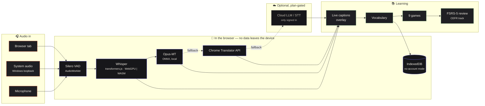
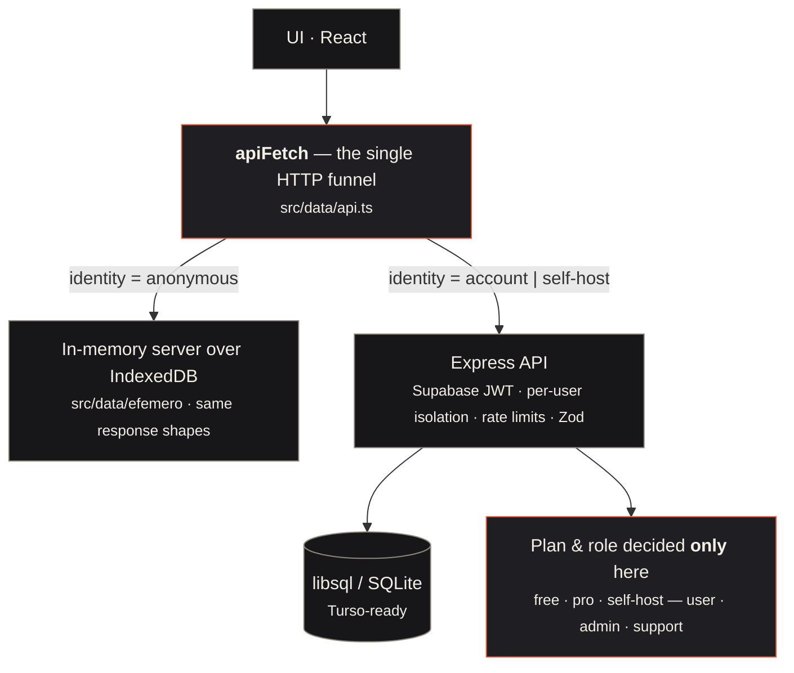

<div align="center">

# Babel Play

**Learn a language from what you already watch, play and talk about.**
Live transcription and translation of any audio on your computer — running **inside your browser** — turned into vocabulary games and spaced repetition.

[🇺🇸 English](README.md) · [🇧🇷 Português](README.pt-BR.md) · [🇨🇳 中文](README.zh-CN.md) · [🇫🇷 Français](README.fr.md) · [🇪🇸 Español](README.es.md)

[](https://github.com/GuilhermeLVL/babel-play/actions/workflows/ci.yml)
[](https://github.com/GuilhermeLVL/babel-play/actions/workflows/seguranca.yml)
[](LICENSE)
[](package.json)


</div>

> **Demo:** coming with the public deploy. Until then, run it locally in three commands — no API key needed.

## Try it

```bash
npm install          # also copies the ONNX Runtime / Silero VAD binaries into public/
cp .env.example .env # set PORT; no API key is needed for the local pipeline
npm run dev          # → http://localhost:<PORT>   (open via localhost: secure context for the models)
```

Choose **Continue without an account**: the whole pipeline runs locally and **not a single
request** reaches the server — that is measured, not promised (see [Measured, not claimed](#measured-not-claimed)).

## What it does

| | |
|---|---|
|  | **Home** — the three fronts of the app (capture, practice, vocabulary) with the real state of each: what is due, what is new, what was never played. Level, streak and seeds are derived from measured events, never typed in. |
|  | **Capture** — a browser tab, the system audio (Windows loopback, no setup) or the microphone. Whisper transcribes in the browser (WebGPU, WASM fallback); Opus-MT, the Chrome Translator API or a cloud LLM translate, always with a fallback chain. Floating captions go over the video or game. |
|  | **Play** — nine short games built from *your* vocabulary (memory, word search, spelling, blitz duel…), with a CEFR track from real word lists. What you get right here counts in the review. |
|  | **No account needed** — the whole local pipeline works without signing up; screens that persist data show an invitation instead of a wall, and what you did in the browser migrates to the account, once, when you sign up. |

**Accounts are optional.** Without one, data lives in IndexedDB; sign up later and it migrates once, idempotently. With one, plans are decided by the server (free: everything local/BYOK; pro: managed cloud AI).

## How it works



### Three independent axes



- **One HTTP funnel.** Every call goes through `apiFetch`. Without an account it is answered by an in-memory server with the same response shapes as the real one — the UI cannot tell the difference. An ast-grep rule forbids `fetch('/api/…')` anywhere else.
- **Identity · plan · role** are separate axes; the client only *paints* the plan, never decides it.
- Sign-up migrates local data once, idempotently (`origem_local_id` unique per user).

Details in [docs/arquitetura.md](docs/arquitetura.md).

## Compatibility

| | |
|---|---|
| WebGPU | Chrome/Edge 113+, Safari 18+; Firefox falls back to WASM (slower, works) |
| First load | ~40–80 MB of model weights from the Hugging Face Hub, cached by the browser |
| System audio | Windows loopback via the local server (self-host), or tab/screen share anywhere |
| WASM threads | need cross-origin isolation (`CROSS_ORIGIN_ISOLATION=1`); single-thread otherwise |

## Measured, not claimed

Everything below comes from scripts in the repo; numbers are from a 2026-08 run.

- **No-account mode: 0 requests to `/api`** across the full flow (probe with a counting `fetch`).
- **Contrast**: 0 nodes below WCAG AA across 14 theme/scheme/profile combinations; 0 targets under 24 px.
- **Capacity** (one process, 4-CPU cpuset, write-heavy load): ~300 req/s; adding cluster workers *reduces* throughput because SQLite has a single writer — scaling means changing the database, not adding processes.
- **Auth**: 7 forged-token vectors (alg:none, algorithm confusion, wrong iss/aud, expiry…) rejected by the real verifier, and a positive control accepted.
- 1,800+ automated tests; typecheck, lint, build and a dependency audit with a named allowlist on every push.

## What doesn't work yet

- Opus-MT int8/fp16 fails to build a session on some devices (ONNX Runtime `qdq_actions`); the app falls back to the next translator, which may be unavailable without an account.
- Screen-share audio on Windows can raise `NotReadableError`; use tab share or the loopback route.
- Game rounds played without an account are not migrated to the account (sessions, audio and cards are).
- Single-writer database: fine for a beta, not for scale.
- No billing yet — plans are set by an admin.

## Verify

```bash
npm run typecheck && npm run typecheck:core && npm run lint && npm test && npm run build
```

## Docs

[Architecture](docs/arquitetura.md) · [Deploy](docs/deploy.md) · [Regression checklist](docs/testes-regressao.md) · [Audit methodology](docs/metodologia-de-auditoria.md) · [Launch plan](docs/lancamento-2026-09.md)

## Contributing · Security · License

[CONTRIBUTING.md](CONTRIBUTING.md) · [SECURITY.md](SECURITY.md) · [MIT](LICENSE)
