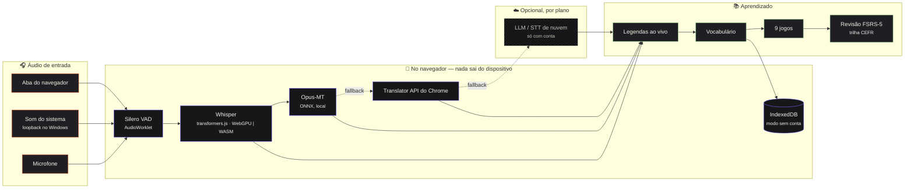
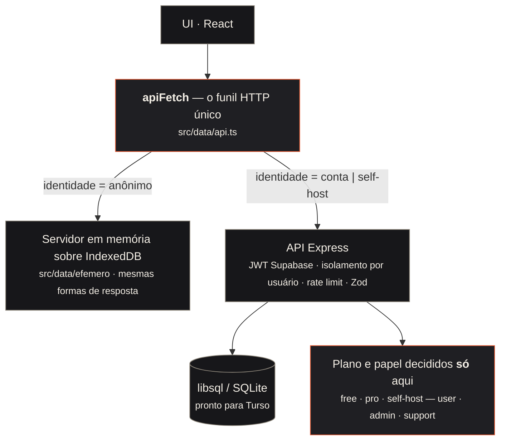

<div align="center">

# Babel Play

**Aprenda um idioma com o que você já assiste, joga e conversa.**
Transcrição e tradução ao vivo de qualquer áudio do computador — rodando **dentro do navegador** — transformadas em jogos de vocabulário e revisão espaçada.

[🇺🇸 English](README.md) · [🇧🇷 Português](README.pt-BR.md) · [🇨🇳 中文](README.zh-CN.md) · [🇫🇷 Français](README.fr.md) · [🇪🇸 Español](README.es.md)

[](https://github.com/GuilhermeLVL/babel-play/actions/workflows/ci.yml)
[](https://github.com/GuilhermeLVL/babel-play/actions/workflows/seguranca.yml)
[](LICENSE)
[](package.json)


</div>

> **Demo:** chega com o deploy público. Até lá, rode localmente em três comandos — sem chave de API.

## Experimente

```bash
npm install          # também copia os binários do ONNX Runtime / Silero VAD para public/
cp .env.example .env # defina PORT; nenhuma chave de API é necessária para o pipeline local
npm run dev          # → http://localhost:<PORT>   (abra via localhost: contexto seguro para os modelos)
```

Escolha **Continuar sem conta**: o pipeline inteiro roda localmente e **nenhuma requisição**
chega ao servidor — isso é medido, não prometido (veja [Medido, não prometido](#medido-não-prometido)).

## O que faz

| | |
|---|---|
|  | **Início** — as três frentes do app (capturar, praticar, vocabulário) com o estado real de cada uma: o que vence hoje, o que é novo, o que nunca foi jogado. Nível, ofensiva e seeds vêm de eventos medidos, nunca digitados. |
|  | **Capturar** — uma aba do navegador, o som do sistema (loopback no Windows, sem configurar) ou o microfone. O Whisper transcreve no navegador (WebGPU, fallback WASM); Opus-MT, a Translator API do Chrome ou um LLM de nuvem traduzem, sempre com cadeia de fallback. Legendas flutuantes por cima do vídeo ou do jogo. |
|  | **Jogar** — nove jogos curtos feitos com o *seu* vocabulário (memória, caça-palavras, soletrar, duelo relâmpago…), com trilha CEFR a partir de listas reais. O que você acerta aqui conta na revisão. |
|  | **Sem conta** — o pipeline local inteiro funciona sem cadastro; as telas que persistem dados mostram um convite em vez de um muro, e o que você fez no navegador sobe para a conta, uma vez, quando você entra. |

**Conta é opcional.** Sem ela, os dados ficam no IndexedDB; ao criar conta, sobem uma vez, de forma idempotente. Com ela, o plano é decidido pelo servidor (free: tudo local/BYOK; pro: IA de nuvem gerenciada).

## Como funciona



### Três eixos independentes



- **Um funil HTTP.** Toda chamada passa por `apiFetch`. Sem conta, quem responde é um servidor em memória com as mesmas formas do servidor real — a UI não sabe a diferença. Uma regra ast-grep proíbe `fetch('/api/…')` em qualquer outro lugar.
- **Identidade · plano · papel** são eixos separados; o cliente só *pinta* o plano, nunca decide.
- Criar conta migra os dados locais uma vez, de forma idempotente (`origem_local_id` único por usuário).

Detalhes em [docs/arquitetura.md](docs/arquitetura.md).

## Compatibilidade

| | |
|---|---|
| WebGPU | Chrome/Edge 113+, Safari 18+; Firefox cai para WASM (mais lento, funciona) |
| Primeira carga | ~40–80 MB de pesos do Hugging Face Hub, em cache no navegador |
| Som do sistema | loopback do Windows via servidor local (self-host), ou compartilhar aba/tela em qualquer lugar |
| Threads WASM | exigem cross-origin isolation (`CROSS_ORIGIN_ISOLATION=1`); senão, thread única |

## Medido, não prometido

Tudo abaixo vem de scripts do repositório; números de uma execução de 2026-08.

- **Modo sem conta: 0 requisições a `/api`** no fluxo completo (sonda com `fetch` contador).
- **Contraste**: 0 nós abaixo do WCAG AA em 14 combinações de tema/esquema/perfil; 0 alvos abaixo de 24 px.
- **Capacidade** (um processo, cpuset de 4 CPUs, carga de escrita): ~300 req/s; mais workers de cluster *reduzem* a vazão porque o SQLite tem um escritor só — escalar é trocar o banco, não somar processos.
- **Auth**: 7 vetores de token forjado (alg:none, confusão de algoritmo, iss/aud errados, expiração…) recusados pelo verificador real, e um controle positivo aceito.
- 1.800+ testes automatizados; typecheck, lint, build e auditoria de dependências com allowlist nomeada a cada push.

## O que ainda não funciona

- Opus-MT int8/fp16 falha em alguns dispositivos (ONNX Runtime `qdq_actions`); cai para o próximo tradutor, que pode não existir sem conta.
- Áudio de compartilhamento de tela no Windows pode dar `NotReadableError`; use aba ou loopback.
- Rodadas jogadas sem conta não migram para a conta (sessões, áudio e cartões migram).
- Banco de escritor único: serve para beta, não para escala.
- Sem cobrança ainda — o plano é definido pelo admin.

## Verificar

```bash
npm run typecheck && npm run typecheck:core && npm run lint && npm test && npm run build
```

## Docs

[Arquitetura](docs/arquitetura.md) · [Deploy](docs/deploy.md) · [Roteiro de regressão](docs/testes-regressao.md) · [Metodologia de auditoria](docs/metodologia-de-auditoria.md) · [Plano de lançamento](docs/lancamento-2026-09.md)

## Contribuir · Segurança · Licença

[CONTRIBUTING.md](CONTRIBUTING.md) · [SECURITY.md](SECURITY.md) · [MIT](LICENSE)
