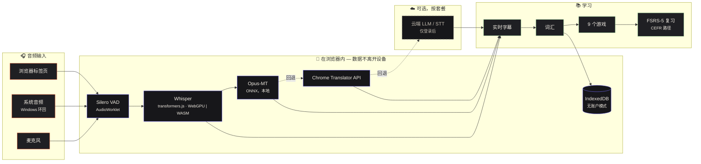

<div align="center">

# Babel Play

**用你已经在看、在玩、在聊的内容学一门语言。**
对电脑上的任何音频进行实时转写和翻译——全部**在浏览器内运行**——并转化为词汇游戏和间隔重复复习。

[🇺🇸 English](README.md) · [🇧🇷 Português](README.pt-BR.md) · [🇨🇳 中文](README.zh-CN.md) · [🇫🇷 Français](README.fr.md) · [🇪🇸 Español](README.es.md)

[](https://github.com/GuilhermeLVL/babel-play/actions/workflows/ci.yml)
[](https://github.com/GuilhermeLVL/babel-play/actions/workflows/seguranca.yml)
[](LICENSE)


</div>

> **演示：** 随公开部署一起上线。在此之前，三条命令即可在本地运行——无需任何 API 密钥。

## 试一试

```bash
npm install          # 同时把 ONNX Runtime / Silero VAD 的二进制文件复制到 public/
cp .env.example .env # 设置 PORT；本地流水线不需要任何 API 密钥
npm run dev          # → http://localhost:<PORT>   （请通过 localhost 打开：模型需要安全上下文）
```

选择**不登录继续使用**：整个流水线在本地运行，**没有任何一个请求**到达服务器——这是实测的，不是承诺。

## 功能

| | |
|---|---|
|  | **首页** — 应用的三个方向（采集、练习、词汇）及各自的真实状态。等级、连续天数和 seeds 由实测事件推导，绝不手填。 |
|  | **采集** — 浏览器标签页、系统音频（Windows 环回，零配置）或麦克风。Whisper 在浏览器中转写（WebGPU，回退 WASM）；Opus-MT、Chrome Translator API 或云端 LLM 负责翻译，始终带有回退链。浮动字幕覆盖在视频或游戏之上。 |
|  | **游戏** — 用*你自己*的词汇构建的九个小游戏（记忆、找词、拼写、闪电对决……），并基于真实词表提供 CEFR 路径。这里答对的内容会计入复习。 |
|  | **无需账户** — 完整的本地流水线无需注册即可使用；需要持久化数据的页面显示邀请而非一堵墙，注册后浏览器中的内容会一次性迁移到账户。 |

**账户是可选的。** 无账户时数据存于 IndexedDB；注册后一次性、幂等地迁移。有账户时由服务器决定套餐（free：全部本地/自带密钥；pro：托管云端 AI）。

## 工作原理



- **唯一的 HTTP 漏斗**（`apiFetch`）：无账户时由内存服务器以与真实服务器相同的响应结构应答，UI 无法区分。
- **身份 · 套餐 · 角色**是三个独立的轴；客户端只*显示*套餐，绝不决定套餐。

详见 [docs/arquitetura.md](docs/arquitetura.md)。

## 实测，而非承诺

- **无账户模式：完整流程对 `/api` 的请求为 0**。
- **对比度**：14 种主题/配色/档案组合中，低于 WCAG AA 的节点为 0；小于 24 px 的点击目标为 0。
- **容量**（单进程，4 核）：约 300 req/s；增加集群 worker 反而*降低*吞吐（SQLite 只有一个写入者）。
- **认证**：7 种伪造令牌向量被真实校验器拒绝，且阳性对照被接受。
- 每次推送运行 1800+ 自动化测试。

## 尚未实现

- Opus-MT int8/fp16 在部分设备上失败；回退到下一个翻译器，而无账户时该翻译器可能不可用。
- Windows 屏幕共享音频可能报 `NotReadableError`；请使用标签页或环回。
- 无账户时玩的回合不会迁移到账户（会话、音频和卡片会迁移）。
- 单写入者数据库：适合测试版，不适合规模化。
- 尚无计费——套餐由管理员设置。

## 验证

```bash
npm run typecheck && npm run typecheck:core && npm run lint && npm test && npm run build
```

[贡献](CONTRIBUTING.md) · [安全](SECURITY.md) · [MIT](LICENSE)
