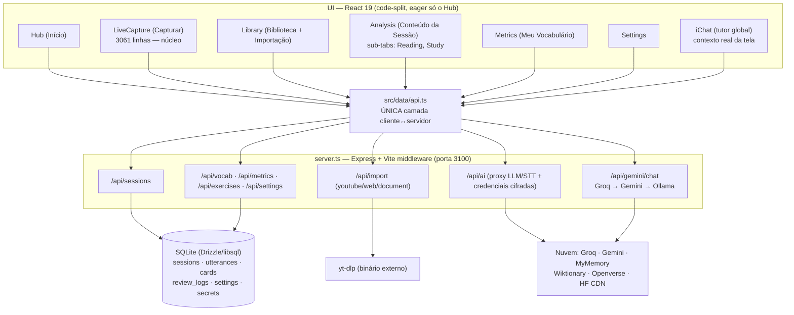
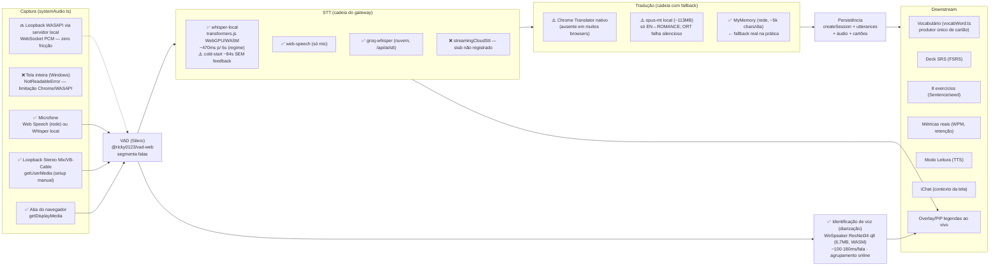
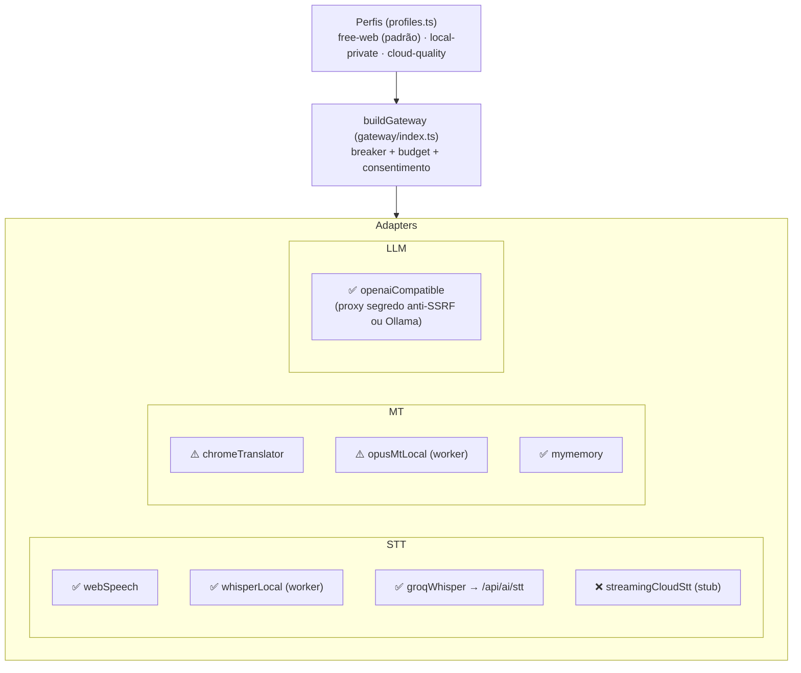
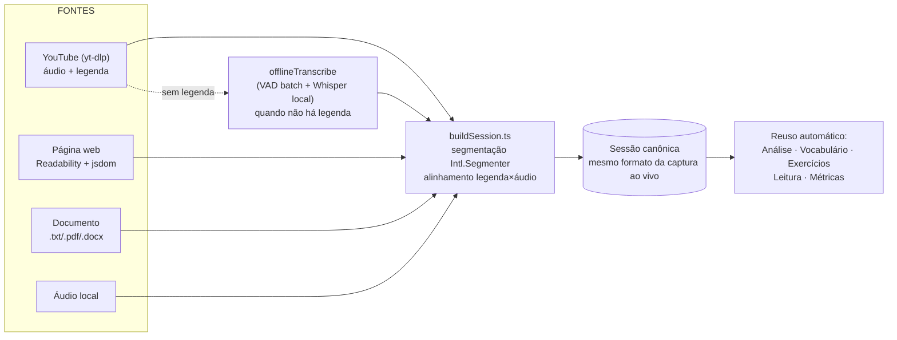

# Arquitetura — Babel Play (TradutorWeb)

> Mapa vivo da aplicação. Atualizado em 2026-07-24 a partir de auditoria completa do código + testes interativos.
> Legenda de estado: ✅ funciona · ⚠️ frágil/degrada · ❌ quebrado/stub · 🔜 planejado

## 1. Visão geral (camadas)

## 2. Fluxo central: captura → transcrição → tradução → estudo

### 2.1 Identificação automática de falantes (2026-07)

Cada fala do **som do computador** no cenário *Conversa* passa por um worker WASM próprio
(`src/lib/speakerIdWorker.ts`) que extrai um *embedding* de voz de 256 dimensões; o agrupamento
online (`src/lib/speakerCluster.ts`) decide se é uma voz já vista ou uma pessoa nova — "Pessoa 1",
"Pessoa 2"… cada uma com cor própria no transcript, no painel Falantes e no overlay. O usuário
renomeia com um clique.

Roda **em paralelo** ao decode (nunca atrasa a legenda) e sempre em WASM, deixando o WebGPU livre
para o Whisper. É *best-effort*: sem o modelo (offline no 1º uso) a captura segue normal e o painel
avisa honestamente.

**Limiar 0.5, medido — não chutado.** Contra o conjunto de verificação de locutor do
`transformers.js-docs` (2 falantes reais × 2 falas): mesmo falante 0.735–0.762, falantes distintos
0.054–0.153 (margem 0.583). O agrupamento acerta de 0.35 a 0.65 e erra em 0.75. Validado ponta a
ponta no navegador: a sequência A,B,A,B produziu `Pessoa 1 → Pessoa 2 → Pessoa 1 → Pessoa 2`.
Limites honestos: vozes muito parecidas podem se fundir e ruído forte pode abrir voz "fantasma".

## 3. AI Gateway — perfis × adapters

> **Roteador de modelo STT** (`src/gateway/sttRouter.ts`, 2026-07): o motor de transcrição é
> escolhido pelo IDIOMA do conteúdo — EN → tiny local; não-EN/multi-idioma → **nuvem primeiro**
> (Groq large-v3-turbo) com reserva local (small no WebGPU, base no WASM), sem travar a captura
> no download da reserva. Perfil Privado/Local nunca roteia p/ nuvem. Override do usuário:
> "Qualidade da transcrição" (auto/rápida/precisa/nuvem) nas configurações avançadas; o selo do
> header mostra o motor efetivo, e cada fala grava o `engine` real (procedência).
>
> **Idioma sem atrito** (2026-07): "Detectar automaticamente" é a PRIMEIRA opção do próprio
> seletor de idioma (o antigo par *select desabilitado + checkbox multi-idioma* virou uma escolha
> só) e vem ligada por padrão — o usuário novo não precisa saber de antemão o que vai ouvir. Cada
> idioma exibe a BANDEIRA (SVG de `country-flag-icons`; emoji de bandeira não renderiza no Windows)
> e cada fala carrega um chip com o idioma REAL detectado. Numa conversa multi-idioma, a fala do
> usuário é vertida para o **idioma dominante** dos outros, apurado ao vivo pela moda das últimas
> falas (`src/lib/convoLang.ts`) — num lobby misto não existe "o idioma deles" fixo.

## 4. Importação → sessão canônica

## 5. Lacunas mapeadas (atualizado 2026-07-24, ciclo 2)

| # | Lacuna | Onde | Estado |
|---|--------|------|--------|
| 1 | Tela inteira sem áudio no Windows (`NotReadableError`) | `systemAudio.ts` | ✅ resolvida na prática: rota "Som do computador ★" (WASAPI via servidor local) |
| 2 | Cold-start do Whisper sem feedback; fala descartada durante carga | `LiveCapture.tsx` | ✅ fala bufferizada + barra agregada + watchdog WebGPU→WASM (45s) |
| 3 | opus-mt local falha silencioso → MyMemory vira o caminho real | `mtWorker.ts` | ⚠️ ainda silencioso — roadmap (avisar o usuário) |
| 4 | Detecção de cache não cobria overrides de modelo | `modelCache.ts` | ✅ corrigida + testada (vitest) |
| 5 | Selo estático falso / diarização com % fabricado | `LiveCapture.tsx` | ✅ selos reais e legíveis; diarização só com dados reais |
| 6 | Modo Visão/OCR inalcançável (~200 linhas mortas) | `LiveCapture.tsx` | ✅ removido (spec vision-ocr-web preservada) |
| 7 | Streaming STT de nuvem | `streamingCloudStt.ts` | ❌ stub (Pro — production-readiness Fase B) |
| 8 | Painéis IA "em breve" | `AnalysisExpandedKpi` · `Hub` · `Metrics` | 🔜 roadmap |
| 9 | Web Speech (default do mic) envia áudio ao provedor | `webSpeech.ts` | ⚠️ agora DITO no onboarding; alternativa local a um clique |
| 10 | Sem testes formais / lint / CI | raiz | ✅ CI Actions + ESLint + vitest (24 testes) + Semgrep/Trivy |
| 11 | Zero auth em `0.0.0.0` + SSRF parcial + fallback de chave inseguro | `server.ts` e afins | ✅ hardening ciclo 2 (bind local, SSRF unificado, SECRET_KEY real, helmet, Zod) |
| 12 | Auth/multi-tenant/billing p/ deploy público | — | 🔜 `openspec/changes/production-readiness` |

## 6. Acesso — três eixos independentes e o modo sem conta (2026-08)

| Eixo | Valores | Onde vive | Quem decide |
|---|---|---|---|
| Identidade | anonimo · conta · selfhost | `src/lib/identidade.ts` (alimentado pelo App) | o cliente (tem sessão ou não) |
| Plano | free · pro · selfhost | tabela `subscriptions`; `src/lib/entitlements.ts` é só cache de `GET /api/me/entitlements` | SÓ o servidor |
| Papel | user · admin · support | `users.role`, `server/lib/rbac.ts` | o servidor |

**Sem conta, nada sai para a rede.** `apiFetch` (`src/data/api.ts`) é o funil único de toda a
camada de dados; com identidade `anonimo` ele responde por um servidor em memória sobre IndexedDB
(`src/data/efemero/servidor.ts` + `store.ts`) que devolve as MESMAS formas do servidor real
(SessionRow, UtteranceRow, VocabRow). O que exige conta responde 501 `EXIGE_CONTA`; só ações da
pessoa (importar, iChat, credenciais) disparam o convite, uma vez por visita. Única exceção ao
"nada sai": `/api/audio/loopback/*`, capacidade do servidor LOCAL, sem banco. A regra ast-grep
`fetch-fora-do-funil` proíbe `fetch('/api/…')` fora do funil; a sonda
`audit/scripts/sonda-anonimo.ts` prova 0 requisições no fluxo completo.

**Gate por view**, não global: hub/capturar/jogar/ajustes abrem sem conta; biblioteca, sessão,
revisão, vocabulário e perfil mostram um convite inline (`src/components/conta/`).

**Migração anônimo → conta** (`src/data/migracao.ts`): por sessão, `POST /api/sessions` com
`origemLocalId` (índice parcial único por usuário; o servidor devolve `jaExistia`), áudio
best-effort, cartões deduplicados, e só então apaga o local. Repetir não duplica.

**Escala**: um processo atende ~300 req/s de escrita; mais workers de cluster pioram (escritor
único do SQLite). Como o anônimo não escreve no servidor, o beta roda em free tier; escalar de
verdade é trocar o banco (Postgres), não somar processos.
