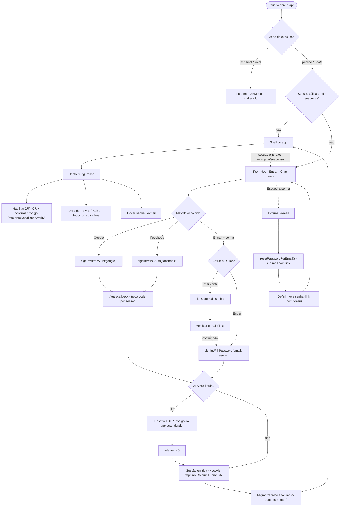

# Fluxo de autenticação + primeira experiência do usuário (desenho)

> Desenho para revisão ANTES da implementação. Objetivo duplo: (1) primeira experiência clara
> (criar conta, entrar com Google/Facebook/e-mail+senha, recuperar senha, 2FA opcional); (2) um
> mapa que facilite ler o fluxo e caçar vulnerabilidades. Ancora em **OWASP ASVS** (V2 auth, V3
> sessão, V4 controle de acesso) e nas decisões já travadas (production-readiness): Supabase Auth,
> sessão em cookie httpOnly, front-door split, soft-gate, RBAC.

## Princípios (por que assim)

- **Identidade é do Supabase.** Nós NUNCA guardamos senha. OAuth, MFA/TOTP, verificação de e-mail e
  reset de senha são recursos NATIVOS do Supabase Auth — usamos, não reimplementamos (OWASP: não role
  sua própria auth). Menos código de segurança = menos vulnerabilidade.
- **Seguir o que já existe.** As telas usam o design system (`.card-panel`, `.btn-ink`, `.ap-input`,
  tokens de `src/index.css`) e o padrão do `src/components/Login.tsx` (Marco 1). A sessão vai para
  cookie httpOnly (`@supabase/ssr`, Fatia 4). O gate de boot fica em `src/App.tsx:379-390`.
- **Autorização ≠ autenticação.** Depois de logar, o acesso a dado é do scoping por `UserId` (Marco 1)
  + RBAC (Fatia 2). Esta camada é só "quem é você"; "o que você pode" já está feito.

## Grafo do fluxo

## Telas (inventário) + estados obrigatórios

| Tela | Método Supabase | Observação |
|---|---|---|
| **Front-door** (entrar) | — | split: painel-marca + botões sociais + form e-mail/senha + "criar" e "esqueci" |
| **Criar conta** | `signUp` | e-mail+senha+confirmar; termos; ou social |
| **Verificar e-mail** | (link do provedor) | "confirme pelo e-mail"; reenviar |
| **Recuperar senha** (pedir) | `resetPasswordForEmail` | só e-mail; resposta genérica |
| **Redefinir senha** | `updateUser({password})` | vem do link com token; força senha forte |
| **Desafio 2FA** | `mfa.challenge` + `mfa.verify` | código TOTP; no login quando habilitado |
| **Conta / Segurança** | `mfa.enroll/unenroll`, `signOut`, `updateUser` | habilitar/desabilitar 2FA (QR), sessões, trocar senha/e-mail |
| **Callback OAuth** | `exchangeCodeForSession` | rota técnica; sem UI (spinner) |

**Estados (todas as telas):** loading · credencial inválida (mensagem GENÉRICA, sem revelar se o
e-mail existe) · conta não verificada · 2FA requerido · sessão expirada (preserva o destino) · erro
de rede (toast + retry) · rate-limit atingido.

## Provedores + 2FA + recuperação (concreto)

- **Provedores no lançamento:** e-mail+senha · **Google** · **Facebook**. Arquitetura aceita adicionar
  Apple/GitHub/etc. depois só habilitando no painel + um botão (sem retrabalho). *(decisão sua se
  quer mais algum já no início.)*
- **2FA:** **TOTP** (app autenticador: Google Authenticator/Authy) — padrão, sem custo e sem as
  fraquezas do SMS. **Opt-in por usuário** (habilita em Conta/Segurança). Recomendado: **códigos de
  backup** na ativação (recuperação se perder o aparelho). *(SMS-2FA é possível, mas tem custo e
  SIM-swap — fora do padrão recomendado.)*
- **Recuperação de senha:** link por e-mail (token único, uso único, expira) — nativo do Supabase.

## Mapa de segurança (ameaça → mitigação → ASVS) — para caçar vulnerabilidade

| Etapa | Ameaça | Mitigação | ASVS |
|---|---|---|---|
| Login e-mail/senha | brute force / credential stuffing | rate-limit do Supabase + mensagem genérica + (senha forte no signup) | V2.2 |
| Signup / recuperação | **enumeração de conta** (descobrir e-mails cadastrados) | resposta SEMPRE genérica ("se existir, enviamos"); verificação por e-mail | V2.1, V2.5 |
| OAuth Google/FB | CSRF no callback / open-redirect | `state` (Supabase) + **allowlist de redirect** no painel; trocar `code` por sessão no callback | V2.x, V5.1 |
| Sessão | roubo de token via **XSS** | **cookie httpOnly+Secure+SameSite** (`@supabase/ssr`) — JS não lê o token | V3.4 |
| Escritas (POST/PATCH) | **CSRF** (por causa do cookie) | `SameSite=Lax/Strict` + token anti-CSRF nas escritas | V4.2 |
| Reset de senha | link previsível / reutilizável | token único, expira, uso único (Supabase) | V2.5 |
| 2FA | bypass / replay do código | `mfa.verify` server-side (Supabase); códigos de backup; passo obrigatório quando enrolled | V2.8 |
| Revogação | conta comprometida/suspensa segue entrando | `users.status='suspended'` já barra no middleware (feito); invalidar refresh no logout | V3.3 |
| Pós-login | acesso a dado de OUTRO usuário | scoping por `UserId` (Marco 1) + RBAC (Fatia 2) — já feito e testado | V4.1 |
| Verificação de e-mail | usar conta não verificada | não emitir sessão plena até confirmar (Supabase) | V2.1 |

## Como encaixa no que já existe (sem dor de cabeça)

- **Cliente:** estende `src/lib/supabase.ts` (já tem o client + `getAccessToken`) com `signInWithOAuth`,
  `signUp`, `resetPasswordForEmail`, `mfa.*`. As telas reusam o design system e o padrão do `Login.tsx`.
- **Gate de boot:** o `src/App.tsx:379-390` já decide login vs app; ganha os estados novos (2FA, verificar).
- **Sessão/cookie/CSRF/revogação:** é a **Fatia 4** (já parcialmente feita: a suspensão já é enforçada).
- **Config Supabase:** habilitar Google/Facebook (OAuth) + e-mail + MFA no painel/via MCP; setar a
  allowlist de redirect. As chaves vão para `.env` (`VITE_SUPABASE_*`, `SUPABASE_URL`).

## Plano de implementação (fatias, testável isolada)

1. **Config Supabase** (via MCP/painel): habilitar e-mail + Google + Facebook + MFA; redirect allowlist;
   `.env` preenchido. *(sem código — infra)*
2. **Client auth service**: `src/lib/auth/` — funções finas por método (email, oauth, reset, mfa) +
   tratamento de erro consistente. Testes.
3. **Telas** (design system): front-door split, criar conta, verificar, recuperar/redefinir, desafio 2FA.
4. **Conta / Segurança**: habilitar 2FA (QR+backup), sessões, trocar senha/e-mail.
5. **Sessão httpOnly + CSRF** (Fatia 4): `@supabase/ssr` no servidor + anti-CSRF nas escritas.
6. **Migração anônimo→conta** (soft-gate) no 1º login.

## Decisões suas (para eu fechar o desenho)
- Provedores no início: só Google+Facebook, ou já incluir Apple/GitHub?
- 2FA: TOTP (recomendado) confirma? SMS não recomendado (custo + SIM-swap).
- Cadastro: aberto a qualquer um (padrão SaaS) ou por convite?
