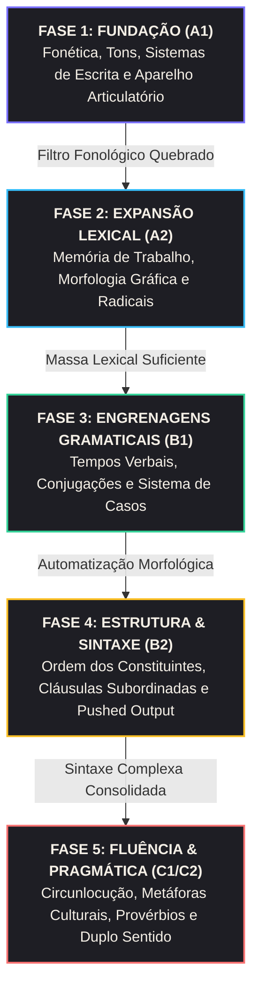
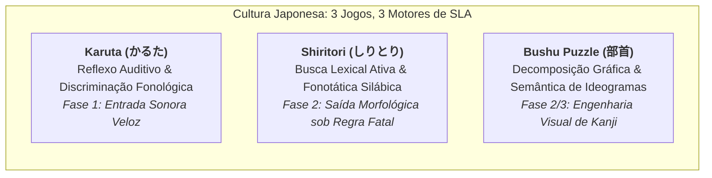
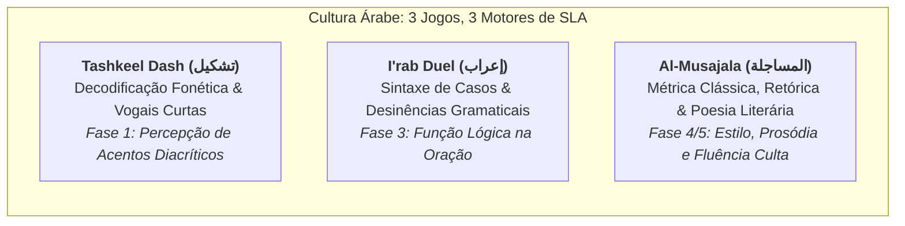
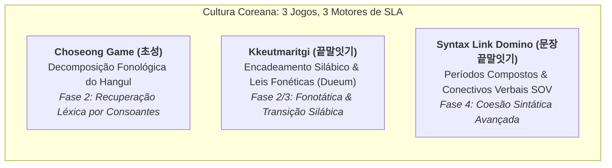

# CURRÍCULO SISTÊMICO DE AQUISIÇÃO DE SEGUNDA LÍNGUA (SLA) BASEADO EM GAMIFICAÇÃO CULTURAL
**Da Fundação Fonética (A1) à Maestria Sociopragmática (C2)**

---

## 1. INTRODUÇÃO: O PARADIGMA DA LUDODIDÁTICA EM SLA

O ensino tradicional de idiomas frequentemente separa a gramática do contexto de uso e relega os "jogos" a meras atividades de aquecimento ou recreação desprovida de rigor instrumental. No entanto, pesquisas contemporâneas em **Aquisição de Segunda Língua (SLA)** e **Neurociência Cognitiva** demonstram que os jogos tradicionais cultivados organicamente por civilizações ao redor do globo não são passatempos ingênuos: eles constituem **tecnologias cognitivas de alta precisão**.

Culturas ao longo dos séculos projetaram jogos de salão, rituais verbais e duelos orais para exercitar precisamente os gargalos de processamento linguístico mais severos:
* A segmentação fonológica contra o filtro da língua materna (*L1 sieve*);
* A busca lexical sob pressão de tempo (*lexical retrieval latency*);
* A automatização de casos gramaticais e concordâncias sem cálculo consciente (*proceduralization*);
* A flexibilidade pragmática de circunlocução quando o léxico exato falha (*strategic competence*).

Este dossiê articula um **currículo instrucional completo**, estruturado em **5 Fases de Progressão (A1 a C2)**. Cada fase é ancorada em literatura científica de SLA e apresenta um catálogo minucioso de mecânicas culturais, com seu foco linguístico cirúrgico, plano de transposição digital e referências verificadas da web.

---

## 2. JORNADA DO APRENDIZ: O MAPA DE PROGRESSÃO (A1 $\rightarrow$ C2)

---

## FASE 1: FUNDAÇÃO (FONÉTICA, TONS, ALFABETOS E PRONÚNCIA)
*Nível-Alvo: A1 (Iniciante Absoluto) | Gargalo Cognitivo: "Cegueira Fonológica" da L1 & Mapeamento Grafema-Fonema*

### 1.1 Fundamentação Científica
* **Teoria de Base:** *High Variability Phonetic Training (HVPT)* e a Teoria do Filtro Fonológico de Trubetzkoy/Kuhl.
* **Artigo Acadêmico de Referência:** **Bradlow, A. R., Pisoni, D. B., Akahane-Yamada, R., & Tohkura, Y. (1997/1999).** *"Training Japanese listeners to identify English /r/ and /l/: Long-term retention of new phonetic categories."* Journal of the Acoustical Society of America, 101(4), 2299-2310. Complementado por **Inceoglu, S., Lim, H., & Chen, J. (2020).** *"Second language pronunciation learning through gamified mobile applications."*
* **Síntese Teórica:** Adultos perdem a capacidade inata de discriminar contrastes fonéticos que não existem em sua língua nativa (o chamado *Native Language Magnet*). A pesquisa empírica de Bradlow e Pisoni demonstrou que a exposição passiva não reconfigura os mapas neurais auditivos; o cérebro exige **discriminação forçada em alta variabilidade com feedback imediato**. A gamificação atua reduzindo a ansiedade de pronúncia (filtro afetivo de Krashen) e transformando a calibragem articulatória e tonal em tarefas percepto-motoras reflexas.

---

### 1.2 Catálogo de Jogos da Fase 1

#### Jogo 1.1: Kyōgi Karuta / Iroha Karuta (競技かるた)
* **Origem e Cultura:** 🇯🇵 **Japão**. Derivado do contato com os navegadores portugueses no século XVI e formalizado no Período Edo. A vertente escolar *Iroha Karuta* foi especificamente desenhada para ensinar o silabário fonético e provérbios infantis.
* **Mecânica na Vida Real:** Um leitor declama um poema ou provérbio. Dezenas de cartas com o texto correspondente estão espalhadas no chão de tatame. Os competidores precisam identificar a carta correta e golpeá-la (*slap*) antes do oponente. A mecânica de ponta é o **Kimariji (決まり字)**: sílabas únicas que já identificam a carta antes mesmo do leitor terminar de pronunciar a palavra.
* **Foco Cirúrgico de SLA:** Discriminação fonológica em alta velocidade e mapeamento áudio-visual direto. Elimina a subvocalização e treina a antecipação auditiva de fonemas no início da emissão sonora.
* **Adaptação Digital:**
  * *Nome no App:* **Audio-Slap Karuta**.
  * *Loop de Gameplay:* O sintetizador de áudio ou gravação nativa começa a tocar uma sílaba/palavra do vocabulário do usuário. Cartas flutuam na tela. O usuário deve tocar na carta correta o mais rápido possível. Um cronômetro mede os milissegundos: se o toque ocorrer durante a primeira sílaba (*Kimariji bonus*), o multiplicador de pontos sobe para 3x.
* **Referências Web & Benchmarking:**
  * *Referência Visual:* [Wikimedia Commons: Karuta Card Game Decks](https://commons.wikimedia.org/wiki/Category:Karuta_(card_game)).
  * *Vídeo de Gameplay:* [Competitive Karuta Championship Rules & Techniques](https://www.youtube.com/results?search_query=competitive+karuta+rules+gameplay).
  * *Apps Concorrentes:* **Competitive Karuta ONLINE** (Android/iOS), **Wasuramoti** (App leitor oficial de treino fonético).

---

#### Jogo 1.2: Tashkeel Dash (تَحَدِّي التَّشْكِيل)
* **Origem e Cultura:** 🇸🇦/🇪🇬 **Mundo Árabe**. As línguas semíticas utilizam o *Abjad*, sistema de escrita consonantal onde as vogais curtas são indicadas por marcas diacríticas (*Harakat* ou *Tashkeel*: Fatha, Damma, Kasra, Sukun, Shaddah). Em escolas corânicas e de caligrafia do Cairo a Bagdá, competições orais exigem vocalizar corretamente textos sem diacríticos.
* **Mecânica na Vida Real:** Os estudantes recebem uma frase sem marcas vocálicas. Um mestre pronuncia a oração em árabe clássico (*Fusha*), e os competidores devem desenhar instantaneamente os acentos vocálicos corretos sobre as consoantes ou ler em voz alta identificando o tom e o comprimento vocálico (vogal curta vs. longa com *Alif/Waw/Ya*).
* **Foco Cirúrgico de SLA:** Discriminação entre consoantes faríngeas/enfáticas (ex: ح vs ه, ou ص vs س) e internalização do sistema de vogais curtas, que ditam tanto o significado lexical quanto a função gramatical da palavra árabe.
* **Adaptação Digital:**
  * *Nome no App:* **Tashkeel Rhythm Runner**.
  * *Loop de Gameplay:* Um texto árabe corre pela tela no estilo *Guitar Hero*. O áudio reproduz a pronúncia correta. O usuário deve pressionar no tempo certo o botão da vogal curta correspondente (Fatha = /a/, Kasra = /i/, Damma = /u/) que coincide com a consoante sob o cursor.
* **Referências Web & Benchmarking:**
  * *Referência Didática:* [Tashkeel Arabic Diacritics Rules & Pronunciation](https://en.wikipedia.org/wiki/Arabic_diacritics).
  * *Vídeo Didático:* [YouTube: Mastering Arabic Tashkeel & Harakat Pronunciation](https://www.youtube.com/results?search_query=arabic+harakat+tashkeel+pronunciation+game).
  * *Apps Concorrentes:* **AlifBee** (App gamificado com ênfase fonética árabe), **Tashkeela Engine**.

---

#### Jogo 1.3: Scioglilingua & Shibboleth Rap (Трабаленгуас / Скороговорки)
* **Origem e Cultura:** 🇲🇽/🇮🇹/🇷🇺 **Tradição Multicultural (México, Itália e Rússia)**. Os trava-línguas folclóricos sempre foram usados em escolas de teatro e trupes teatrais russas (*Skorogovorki*) e italianas (*Scioglilingua*) para destravar a musculatura facial e a transição entre fonemas de pontos de articulação adjacentes.
* **Mecânica na Vida Real:** Participantes recitam sequências fonéticas que alternam consoantes palatalizadas vs. duras (em russo), líquidas e vibrantes múltiplas (o "RR" em espanhol e italiano: *"Erre con erre cigarro, erre con erre barril..."*) sob uma batida rítmica que acelera progressivamente. Quem tropeça ou troca o fonema é desclassificado.
* **Foco Cirúrgico de SLA:** Plasticidade motora do aparelho fonador. Transição de pontos articulatórios incomuns para nativos de outras línguas (como as consoantes palatalizadas russas /tʲ/, /dʲ/ ou as vibrantes apico-alveolares do espanhol).
* **Adaptação Digital:**
  * *Nome no App:* **Vocal Beat Battle**.
  * *Loop de Gameplay:* O app toca uma batida rítmica lo-fi. Uma frase curta contendo pares mínimos complexos aparece na tela. O usuário pronuncia a frase no microfone sincronizado com o metrônomo. O modelo de reconhecimento fonético (VAD + Whisper/Wav2Vec local) avalia a precisão acústica e a fluidez sem hesitação, atribuindo pontuação de ritmo.
* **Referências Web & Benchmarking:**
  * *Vídeo Ilustrativo:* [YouTube: Russian Skorogovorki Tongue Twisters Challenge](https://www.youtube.com/results?search_query=russian+skorogovorki+challenge).
  * *Apps Concorrentes:* **ELSA Speak** (análise acústica de pronúncia), **Speechling**.

---

## FASE 2: EXPANSÃO LEXICAL (MEMÓRIA, RADICAIS E VOCABULÁRIO BASE)
*Nível-Alvo: A2 (Elementar) | Gargalo Cognitivo: Curva do Esquecimento e Recuperação Léxica Ativa*

### 2.1 Fundamentação Científica
* **Teoria de Base:** *Involvement Load Hypothesis* e o Efeito de Prática de Recuperação (*Retrieval Practice Effect*).
* **Artigo Acadêmico de Referência:** **Hulstijn, J. H., & Laufer, B. (2001).** *"Some empirical evidence for the Involvement Load Hypothesis in vocabulary acquisition."* Language Learning, 51(3), 539-558. Complementado por **Roediger, H. L., & Karpicke, J. D. (2006).** *"The power of testing memory: Basic research and implications for educational practice."*
* **Síntese Teórica:** Hulstijn e Laufer demonstraram que a retenção lexical duradoura não depende do número de vezes que um aluno vê uma palavra em um flashcard passivo, mas sim da **Carga de Envolvimento (Involvement Load)** da tarefa, decomposta em três dimensões:
  1. *Need* (Necessidade comunicativa);
  2. *Search* (Busca ativa da forma ou do significado na memória);
  3. *Evaluation* (Comparação da palavra com outros candidatos semânticos e morfológicos).
  Jogos que forçam a recombinação morfológica ou a evocação a partir de restrições gráficas ativam índices de *Search* e *Evaluation* máximos, gerando fixação até 4x superior à simples memorização espaçada tradicional.

---

### 2.2 Catálogo de Jogos da Fase 2

#### Jogo 2.1: Choseong Game (초성게임 - O Jogo das Consoantes Iniciais)
* **Origem e Cultura:** 🇰🇷 **Coreia do Sul**. Jogo onipresente na cultura pop coreana, salas de aula de Seul e programas de auditório como *Running Man*. O alfabeto coreano (*Hangul*) é modular: cada bloco silábico é composto por uma consoante inicial (*Choseong*), uma vogal média (*Jungseong*) e, opcionalmente, uma consoante final (*Jongseong*).
* **Mecânica na Vida Real:** O desafiante dita apenas as consoantes iniciais de uma palavra de duas ou três sílabas (ex: **"ㅎㅅ"**). Os participantes devem gritar uma palavra válida cujas sílabas comecem com essas consoantes (ex: 호수 - *hosu* [lago], 회사 - *hoesa* [empresa], 학생 - *haksaeng* [estudante]).
* **Foco Cirúrgico de SLA:** Desconstrução e análise estrutural do Hangul. Em vez de ler palavras como blocos opacos, o cérebro do estudante automatiza a montagem dos grafemas e ativa a busca lexical rápida por pistas consonantais.
* **Adaptação Digital:**
  * *Nome no App:* **Hangul Consonant Decrypter**.
  * *Loop de Gameplay:* O app exibe o par de consoantes (ex: "ㄱㄷ"). O jogador tem 12 segundos para digitar ou arrastar vogais para formar uma palavra válida pertencente à sua lista de palavras capturadas. Se o jogador encontrar uma palavra rara ou temática do módulo atual, ganha pontuação multiplicada.
* **Referências Web & Benchmarking:**
  * *Referência Cultural:* [Danobang: Choseong Game Online Rules](https://danobang.com/).
  * *Vídeo de Gameplay:* [YouTube: Running Man Choseong Game Clips](https://www.youtube.com/results?search_query=running+man+choseong+game).
  * *Apps Concorrentes:* **Danobang Online**, minigames embutidos no **Naver Dictionary**.

---

#### Jogo 2.2: Balda (Балда - O Quadrado Léxico Eslavo)
* **Origem e Cultura:** 🇷🇺 **Rússia e Leste Europeu**. Jogo de caderno quadriculado praticado por gerações de estudantes russos nos intervalos escolares desde o período soviético. O nome *Balda* alude jocosamente ao tolo ou perdedor da rodada.
* **Mecânica na Vida Real:** Desenha-se uma grade 5x5 em folha quadriculada. No meio, escreve-se uma palavra inicial de 5 letras. A cada turno, o jogador adiciona **uma única letra** em uma célula vazia ortogonalmente adjacente e deve soletrar uma nova palavra válida que utilize a letra recém-colocada, fazendo um caminho contínuo (horizontal/vertical, sem repetir casas). Tradicionalmente, apenas substantivos no caso nominativo singular são permitidos. Cada letra da palavra formada rende 1 ponto.
* **Foco Cirúrgico de SLA:** Expansão da flexibilidade morfológica, domínio ortográfico do alfabeto cirílico e visualização espacial de raízes, prefixos e desinências lexicais.
* **Adaptação Digital:**
  * *Nome no App:* **Balda Grid Master**.
  * *Loop de Gameplay:* Grade 5x5 interativa na tela. O usuário joga contra um bot ou outro usuário. Ao posicionar a letra, traça o dedo sobre as células para formar a palavra. O app valida instantaneamente contra o dicionário oficial e exibe o significado da palavra formada, reforçando a memória semântica.
* **Referências Web & Benchmarking:**
  * *Referência Histórica e Regras:* [Balda Online Game Rules](https://balda-online.org/).
  * *Vídeo de Demonstração:* [YouTube: How to Play Balda Word Game](https://www.youtube.com/results?search_query=balda+game+russian+rules).
  * *Apps Concorrentes:* **Balda Online** (Play Store / App Store), **Slovobor**.

---

#### Jogo 2.3: Bushu Deconstructor (部首パズル - O Desafio dos Radicais de Kanji)
* **Origem e Cultura:** 🇯🇵/🇨🇳 **Japão e China**. Tanto no aprendizado de Kanji no Japão quanto de Hanzi na China, o Ministério da Educação utiliza o sistema tradicional de **Radicais (部首 - Bushu)** — componentes gráficos elementares (como água 氵, fogo 灬, árvore 木, coração 忄) que carregam pistas semânticas e fonéticas cruciais para decifrar os milhares de ideogramas.
* **Mecânica na Vida Real:** Cartões contendo radicais isolados são colocados na mesa. O professor ou árbitro lança um radical-base (ex: "Água" - 氵). Os alunos devem combinar esse radical com outros blocos da mesa para formar ideogramas válidos (ex: 氵 + 木 + 目 = 湘; 氵 + 毎 = 海 [mar]; 氵 + 青 = 清 [puro]) e recitar sua leitura e significado.
* **Foco Cirúrgico de SLA:** Superação da memorização por "força bruta". Transforma a escrita logográfica de um emaranhado caótico de traços em uma matriz combinatória lógica e modular, acelerando a taxa de alfabetização e retenção.
* **Adaptação Digital:**
  * *Nome no App:* **Kanji Fusion Lab**.
  * *Loop de Gameplay:* Uma esteira mecânica traz blocos de radicais semânticos à esquerda e componentes fonéticos à direita. O usuário deve arrastar e colidir dois ou três blocos no centro para fundi-los em um ideograma completo que corresponda à tradução exigida na tela.
* **Referências Web & Benchmarking:**
  * *Referência Estrutural:* [Tofugu's Guide to Kanji Radicals](https://www.tofugu.com/japanese/kanji-radicals/).
  * *Vídeo Didático:* [YouTube: Learn Kanji with Radicals Game](https://www.youtube.com/results?search_query=learn+kanji+with+radicals+game).
  * *Apps Concorrentes:* **WaniKani** (método mnemônico de radicais), **Kanji Study**.

---

## FASE 3: ENGRENAGENS GRAMATICAIS (TEMPOS, CONJUGAÇÕES E CASOS)
*Nível-Alvo: B1 (Intermediário) | Gargalo Cognitivo: Lacuna entre Conhecimento Declarativo e Procedimental*

### 3.1 Fundamentação Científica
* **Teoria de Base:** *Skill Acquisition Theory* e a Hipótese de *Focus on Form (FonF)*.
* **Artigo Acadêmico de Referência:** **DeKeyser, R. M. (2007).** *"Practice in a second language: Perspectives from applied linguistics and cognitive psychology."* Cambridge University Press. E **Long, M. H. (1991).** *"Focus on form: A design feature in language teaching methodology."*
* **Síntese Teórica:** DeKeyser explica que a gramática começa como **conhecimento declarativo** (regras memorizadas conscientemente: *"o acusativo masculino em alemão muda de 'der' para 'den'"*). O aluno só adquire fluência operacional quando esse saber passa pelo estágio associativo até se tornar **conhecimento procedimental automatizado**. O *Focus on Form (FonF)* de Michael Long prescreve que a gramática não deve ser ensinada isolada, mas sim engatilhada como mecanismo necessário para resolver um problema comunicativo dentro de uma tarefa interativa. Jogos com restrições gramaticais exigem que a forma correta seja aplicada em milissegundos para vencer o desafio.

---

### 3.2 Catálogo de Jogos da Fase 3

#### Jogo 3.1: Ich packe meinen Koffer ("Arrumando a Mala" - O Duelo do Acusativo)
* **Origem e Cultura:** 🇩🇪 **Alemanha, Áustria e Suíça**. Clássico absoluto das famílias germânicas e a dinâmica padrão adotada pelo Goethe-Institut em cursos de *DaF (Deutsch als Fremdsprache)*.
* **Mecânica na Vida Real:** Em círculo, o primeiro jogador diz: *"Ich packe in meinen Koffer..."* e cita um objeto com seu artigo indefinido declinado no caso acusativo (*"...einen Schirm"* - um guarda-chuva). O próximo jogador deve repetir rigorosamente a sentença, os itens anteriores na ordem exata e acrescentar um novo item corretamente declinado:
  * Masculino: *...einen Koffer*
  * Feminino: *...eine Jacke*
  * Neutro: *...ein Buch*
  Se um participante errar o gênero do substantivo ou a desinência do acusativo (ex: disser *"ein Schirm"* em vez de *"einen Schirm"*), ele perde imediatamente.
* **Foco Cirúrgico de SLA:** Automatização das terminações de caso e concordância de gênero nominal. Obriga a memória de trabalho fonológica a recuperar simultaneamente o léxico e a regra morfossintática em tempo real.
* **Adaptação Digital:**
  * *Nome no App:* **Der-Die-Das Suitcase**.
  * *Loop de Gameplay:* Uma mala aberta no centro da tela. Itens passam por uma esteira. O app anuncia o objeto; o usuário tem 3 segundos para selecionar a etiqueta correta entre três opções (*Einen*, *Eine*, *Ein* / *Den*, *Die*, *Das*). O modo "Desafio de Memória" exige que o aluno reordene os 5 itens da rodada anterior antes de inserir o novo.
* **Referências Web & Benchmarking:**
  * *Referência Didática:* [Goethe-Institut DaF Lehrmaterialien: Ich packe meinen Koffer](https://www.goethe.de/).
  * *Vídeo Demonstrativo:* [YouTube: Ich packe meinen Koffer Deutsch Spiel](https://www.youtube.com/results?search_query=ich+packe+meinen+koffer+deutsch+lernen).
  * *Apps Concorrentes:* **Der Die Das App**, seções gramaticais do **Babbel**.

---

#### Jogo 3.2: Tense Tennis / Pelota Gramatical (O Tênis dos Tempos Verbais)
* **Origem e Cultura:** 🇪🇸/🇲🇽 **Espanha e América Latina**. Criado em institutos de ensino comunicativo de espanhol (*ELE - Español como Lengua Extranjera*), utiliza a dinâmica de rebatida rápida para dominar o complexo sistema verbal hispânico (especialmente o contraste entre Pretérito Perfecto Simple vs. Imperfecto e o Modo Subjuntivo).
* **Mecânica na Vida Real:** Dois participantes ou duas equipes posicionam-se frente a frente com uma bola de tênis. O "sacador" lança a bola e grita um verbo no infinitivo e um pronome (ex: *"Comer, Nosotros!"*). O receptor deve rebater a bola dizendo o verbo conjugado no tempo estipulado na rodada (ex: se a rodada for Pretérito Indefinido: *"¡Comimos!"*). Em rodadas avançadas, o sacador grita a mudança de tempo: *"¡Pasado!", "¡Futuro!", "¡Subjuntivo!"*.
* **Foco Cirúrgico de SLA:** Superação da hesitação na flexão verbal irregular. Elimina o cálculo mental de tabelas de conjugação e desenvolve reflexo oral instantâneo para desinências número-pessoais e modo-temporais.
* **Adaptação Digital:**
  * *Nome no App:* **Verbal Rally**.
  * *Loop de Gameplay:* Interface no estilo jogo de tênis/pong retrô. Uma bola viaja em direção à raquete do jogador. Na bola está escrito o infinitivo e o sujeito (ex: *"Ir - Yo"*). Três alvos no campo adversário mostram conjugações concorrentes (*Fui*, *Iba*, *Vaya*). O usuário deve rebater inclinando o controle ou tocando no alvo exigido pelo placar de tempos verbais antes que a bola cruze a linha.
* **Referências Web & Benchmarking:**
  * *Referência Didática:* [ProfedeELE: Juegos de Conjugación y Gramática Activa](https://www.profedeele.es/).
  * *Vídeo de Aplicação:* [YouTube: Spanish Verb Conjugation Classroom Games](https://www.youtube.com/results?search_query=spanish+verb+conjugation+games+classroom).
  * *Apps Concorrentes:* **Conjugato** (app especializado em verbos em espanhol), **Ella Verbs**.

---

#### Jogo 3.3: I'rab Duel (تَحَدِّي الإِعْرَاب - O Desafio das Desinências Sintáticas)
* **Origem e Cultura:** 🇪🇬/🇯🇴 **Mundo Árabe**. O *I'rab* é o sofisticado sistema de declinação casual do Árabe Padrão Moderno e Clássico (*Fusha*), onde a vogal final da palavra muda conforme seu papel na oração: Nominativo (*Marfoo'* com Damma), Acusativo (*Mansoob* com Fatha) e Genitivo (*Majroor* com Kasra). É a disciplina mais desafiadora da gramática árabe, tradicionalmente ensinada por duelos de análise em círculos universitários e poéticos.
* **Mecânica na Vida Real:** O moderador declama uma oração com a última vogal suprimida. Dois participantes competem para apontar instantaneamente a função sintática (ex: é o *Faa'il* [sujeito agente], o *Maf'ool bihi* [objeto direto] ou *Mudaaf Ilayhi* [posse]) e recitar a palavra com a terminação fonética exata.
* **Foco Cirúrgico de SLA:** Conexão intrínseca entre sintaxe e fonologia. Impede que o aprendiz trate a gramática como regras decoradas e o ensina a "ler" a função estrutural de cada termo através de sua desinência fonética.
* **Adaptação Digital:**
  * *Nome no App:* **I'rab Striker**.
  * *Loop de Gameplay:* O app apresenta uma frase com um termo destacado. O jogador controla um escudo com três lados correspondentes aos 3 casos árabes. Flechas representando a função sintática da frase caem sobre o termo; o jogador deve girar o escudo para aparar com o caso gramatical correto antes do impacto.
* **Referências Web & Benchmarking:**
  * *Referência Teórica:* [Arabic Inflection & I'rab System Overview](https://en.wikipedia.org/wiki/%CA%BEI%CA%BFrab).
  * *Vídeo Explicativo:* [YouTube: Learn Arabic Grammar and I'rab Interactively](https://www.youtube.com/results?search_query=learn+arabic+irab+grammar+rules).
  * *Apps Concorrentes:* **Arabic Unlocked**, **Madinah Arabic Game Modules**.

---

## FASE 4: ESTRUTURA E SINTAXE (ORDEM DAS PALAVRAS E ORAÇÕES COMPLEXAS)
*Nível-Alvo: B2 (Independente Avançado) | Gargalo Cognitivo: Fossilização Sintática e Tradução Estrutural da L1*

### 4.1 Fundamentação Científica
* **Teoria de Base:** *Processability Theory* e a Hipótese do *Pushed Output*.
* **Artigo Acadêmico de Referência:** **Pienemann, M. (1998).** *"Language processing and second language development: Processability theory."* Studies in Second Language Acquisition, 20(1). E **Swain, M. (2005).** *"The Output Hypothesis: Theory and research."* In Handbook of Research in Second Language Teaching and Learning.
* **Síntese Teórica:** Merrill Swain demonstrou que a compreensão passiva (*input*) processa o conteúdo semântico sem necessariamente analisar a fundo a gramática. Para dominar a sintaxe e a ordem frasal complexa (especialmente estruturas que diferem radicalmente da língua materna, como a posição final do verbo subordinado em alemão ou a estrutura SOV em coreano e japonês), o aluno precisa ser colocado sob **Pushed Output** — a exigência de produzir enunciados estruturados sob restrições estritas que forçam o cérebro a testar hipóteses sintáticas e reorganizar a ordem dos constituintes.

---

### 4.2 Catálogo de Jogos da Fase 4

#### Jogo 4.1: Le Cadavre Exquis Sintático (O Cadáver Delicado das Classes Gramaticais)
* **Origem e Cultura:** 🇫🇷 **França**. Nascido em Paris em 1925 nos círculos surrealistas de André Breton, Jacques Prévert e Yves Tanguy. Foi amplamente adotado nas escolas francesas e em cursos de FLE (*Français Langue Étrangère*) pela sua eficácia em ensinar a ordem canônica dos constituintes da oração e a concordância de gênero e número.
* **Mecânica na Vida Real:** Em uma folha de papel dobrada em sanfona, participantes sentam-se em círculo. Cada um escreve estritamente uma categoria gramatical em seu turno, sem ver o que os anteriores redigiram:
  $$\text{Jogador 1: Sujeito + Artigo} \longrightarrow \text{Jogador 2: Adjetivo} \longrightarrow \text{Jogador 3: Verbo Transitivo} \longrightarrow \text{Jogador 4: Objeto Direto} \longrightarrow \text{Jogador 5: Advérbio / Locução}$$
  Ao abrir o papel, lê-se a frase resultante: sintaticamente irretocável e gramaticalmente correta, porém semanticamente hilária e poética (como a histórica: *"Le cadavre / exquis / boira / le vin / nouveau"*).
* **Foco Cirúrgico de SLA:** Fixação dos slots sintáticos (árvore sintática mental), flexão de particípios e adjetivos em concordância com o substantivo precedente e manipulação de orações relativas e conectivos subordinativos sem bloqueio criativo.
* **Adaptação Digital:**
  * *Nome no App:* **Surreal Sentence Crafter**.
  * *Loop de Gameplay:* Três jogadores em rede (ou o usuário com 2 bots) recebem a missão de montar uma oração complexa. O app distribui "cartas de missão gramatical" (ex: *"Insira um adjetivo feminino plural que concorde com o sujeito escondido"* ou *"Insira um verbo no condicional com pronome clítico"*). Ao final, a IA ilustra a frase absurda resultante e gera um cartão colecionável com a análise sintática explicada.
* **Referências Web & Benchmarking:**
  * *Referência Histórica:* [Wikimedia Commons: Cadavre Exquis Surrealist Documents](https://commons.wikimedia.org/wiki/Category:Cadavre_exquis).
  * *Vídeo Educativo:* [YouTube: Le Cadavre Exquis Règles et Pédagogie FLE](https://www.youtube.com/results?search_query=cadavre+exquis+regles+du+jeu).
  * *Apps Concorrentes:* **Mad Libs Mobile**, ferramentas de criação de histórias como **StoryDice**.

---

#### Jogo 4.2: Kkeutmaritgi Sintático (문장 끝말잇기 - O Dominó de Orações Conectivas)
* **Origem e Cultura:** 🇰🇷 **Coreia do Sul**. Adaptação avançada do jogo tradicional de encadeamento de palavras *Kkeutmaritgi* (끝말잇기), praticada em colégios preparatórios de redação (*hagwons*) e cursos de coreano para estrangeiros (TOPIK II).
* **Mecânica na Vida Real:** Em vez de encadear sílabas isoladas, os estudantes encadeiam **cláusulas sintáticas**. O primeiro jogador constrói uma oração que termina com uma partícula conectiva gramatical específica (ex: causal -기 때문에, condicional -(으)면, ou concessiva -는데도). O jogador seguinte é obrigado a começar sua frase com uma oração subordinada que justifique logicamente e concorde com a desinência da oração anterior.
* **Foco Cirúrgico de SLA:** Domínio da ordem frasal SOV (Sujeito-Objeto-Verbo) e da complexa teia de sufixos conectivos verbais (*Eomi - 어미*) do coreano, eliminando a tendência de nativos ocidentais de construir frases fragmentadas coordenadas em vez de períodos compostos elegantes.
* **Adaptação Digital:**
  * *Nome no App:* **Syntax Link Domino**.
  * *Loop de Gameplay:* Na tela surgem peças de dominó com fragmentos de frases. O lado direito de uma peça possui um conector causal ou temporal; o usuário deve buscar em seu deck de palavras capturadas uma oração que se acople perfeitamente com a flexão exigida, testando a coesão textual e a lógica discursiva.
* **Referências Web & Benchmarking:**
  * *Referência das Regras Tradicionais:* [Kkeutmaritgi Korean Word Chain Overview](https://en.wikipedia.org/wiki/Kkeutmaritgi).
  * *Vídeo Cultural:* [YouTube: Kkeutmaritgi Game in Korean TV Shows](https://www.youtube.com/results?search_query=kkeutmaritgi+korean+variety+show).
  * *Apps Concorrentes:* **Kkeutmaritgi Online Servers**, módulos avançados do **Talk To Me In Korean (TTMIK)**.

---

#### Jogo 4.3: Al-Musajala ash-Shi'riyya Sintática (المساجلة الشعرية النحوية)
* **Origem e Cultura:** 🇸🇦/🇮🇶/🇱🇧 **Mundo Árabe**. A *Musajala* poética é praticada há mais de mil anos, desde a época pré-islâmica e a Idade de Ouro de Bagdá. Em feiras literárias históricas como *Souq Okaz*, poetas duelavam declamando versos onde a última letra e a métrica estrita (*Bahr*) de um verso ditavam o início do próximo.
* **Mecânica na Vida Real:** O competidor "A" recita um verso (*Bayt*) de poesia clássica. O competidor "B" tem até 10 segundos para recitar um verso legítimo que comece com a última letra do verso de "A". Na variação pedagógica gramatical, exige-se que a oração de resposta cumpra um requisito sintático estipulado pelo árbitro (ex: conter uma oração condicional com *In/Law* [إِنْ / لَوْ] ou uma estrutura de exceção com *Illa* [إِلَّا]).
* **Foco Cirúrgico de SLA:** Competência prosódica, memorização de estruturas sintáticas refinadas e uso correto de conectivos lógicos da alta literatura e da mídia formal árabe.
* **Adaptação Digital:**
  * *Nome no App:* **Poetic Duel Arena**.
  * *Loop de Gameplay:* O app apresenta o verso clássico falado por áudio imersivo. O usuário visualiza blocos de orações e deve montar em ordem sintática e métrica a resposta poética antes que a areia da ampulheta digital se esgote.
* **Referências Web & Benchmarking:**
  * *Referência Histórica e Cultural:* [Al-Musajala Poetry Debate Traditions](https://en.wikipedia.org/wiki/Arabic_poetry).
  * *Vídeo de Competição:* [YouTube: Arabic Musajala Poetry Contest Live](https://www.youtube.com/results?search_query=al-musajala+arabic+poetry+competition).
  * *Apps Concorrentes:* **Adab (أدب)**, **Diwan**.

---

## FASE 5: FLUÊNCIA E CULTURA (PROVÉRBIOS, METÁFORAS E CIRCUNLOCUÇÃO)
*Nível-Alvo: C1/C2 (Proficiência Plena) | Gargalo Cognitivo: O Platô Intermediário e a Rigidez Denotativa*

### 5.1 Fundamentação Científica
* **Teoria de Base:** *Strategic Competence* e a Taxonomia de Estratégias Comunicativas de Dörnyei & Scott.
* **Artigo Acadêmico de Referência:** **Dörnyei, Z., & Scott, M. L. (1997).** *"Communication strategies in a second language: Definitions and taxonomies."* Language Learning, 47(1), 173-210. E **Canale, M., & Swain, M. (1980).** *"Theoretical bases of communicative approaches to second language teaching and testing."*
* **Síntese Teórica:** Canale e Swain dividiram a competência comunicativa em quatro pilares: gramatical, sociolinguística, discursiva e **estratégica**. Dörnyei e Scott comprovaram que a marca definitiva do falante proficiente (C1/C2) não é conhecer todas as palavras do dicionário, mas sim a posse de **estratégias de circunlocução** — a capacidade de contornar uma falha lexical sem travar a conversa, empregando paráfrases (*"é um objeto de metal usado para..."*), aproximações conceituais, metáforas culturais e descrições funcionais. Jogos de palavras proibidas e enigmas culturais são o treinamento supremo desse músculo mental.

---

### 5.2 Catálogo de Jogos da Fase 5

#### Jogo 5.1: Taboo / Tabú & A Forja da Circunlocução
* **Origem e Cultura:** 🇺🇸/🇬🇧 **Cultura Anglófona e Salas de Aula ESL Globais**. Criado comercialmente em 1989, o jogo tornou-se o padrão-ouro de pedagogia comunicativa em universidades e centros de idiomas do mundo inteiro.
* **Mecânica na Vida Real:** O jogador retira uma carta com uma palavra-chave (ex: **"SUNGLASSES"**). Abaixo dela constam 5 "palavras tabu" que ele está estritamente proibido de pronunciar (ex: *Eyes, Sun, Dark, Glasses, Summer*). O jogador tem 60 segundos para fazer seu parceiro adivinhar a palavra-chave usando apenas circunlocuções periféricas: *"It is an optical accessory that human beings wear on their face when they walk outside at midday to filter bright ultraviolet rays..."*.
* **Foco Cirúrgico de SLA:** Destruição do vício de tradução mental literal. Força o uso intensivo de pronomes relativos, adjetivos de textura, forma e função, e desenvolve agilidade para descrever qualquer ideia quando o termo exato foge à memória.
* **Adaptação Digital:**
  * *Nome no App:* **Taboo AI Arena**.
  * *Loop de Gameplay:* A tela mostra a palavra e os 4 termos tabu. O aluno pressiona o botão do microfone e fala por até 30 segundos no idioma-alvo. O modelo de Speech-to-Text integrado com um LLM analisa o áudio em tempo real: se o aluno usar uma palavra tabu, soa uma campainha e o termo fica vermelho; o LLM tenta adivinhar o conceito a partir da descrição do aluno, atribuindo nota de riqueza vocabular.
* **Referências Web & Benchmarking:**
  * *Referência Pedagógica:* [Wordwall: ESL Taboo Speaking Activities](https://wordwall.net/resource/taboo-esl).
  * *Vídeo Demonstrativo:* [YouTube: How to Play Taboo for Language Fluency](https://www.youtube.com/results?search_query=taboo+game+esl+speaking+practice).
  * *Apps Concorrentes:* **Heads Up!**, **Taboo Official Mobile** (Marmalade Games).

---

#### Jogo 5.2: Vitendawili: O Duelo de Enigmas Suaíli (Tega! / Tegua!)
* **Origem e Cultura:** 🇰🇪/🇹🇿 **África Oriental (Quênia, Tanzânia, Zanzibar)**. Os *Vitendawili* (singular: *Kitendawili*) são enigmas metafóricos tradicionais da cultura suaíli, praticados ao redor da fogueira à noite para educar crianças e jovens na sabedoria comunitária, aguçar o raciocínio figurado e preservar provérbios ancestrais.
* **Mecânica na Vida Real:** O jogo possui um ritual de chamada e resposta codificado:
  1. O desafiador proclama: *"Kitendawili!"* (Tenho um enigma!).
  2. O grupo responde em uníssono: *"Tega!"* (Arme a armadilha!).
  3. O desafiador declama a metáfora poética (ex: *"Nyumba yangu haina mlango"* - Minha casa não tem porta).
  4. Se o grupo não conseguir responder, deve "pagar" oferecendo uma cidade simbólica (*"Tupe mji!"* - Dê-nos uma cidade: *"Tunakupa Mombasa!"*). Só então o desafiador revela a resposta (*"Yai"* - Um ovo!).
* **Foco Cirúrgico de SLA:** Decodificação de metáforas culturais africanas, personificação da natureza, domínio da oralidade ritualizada e ampliação do repertório conceitual além do etnocentrismo linguístico ocidental.
* **Adaptação Digital:**
  * *Nome no App:* **Vitendawili Trap Duel**.
  * *Loop de Gameplay:* O app atua como o ancião que propõe o enigma com voz nativa e trilha de percussão tradicional. O usuário deve falar pelo microfone *"Tegua!"* e digitar/falar a resposta metafórica. Caso não saiba, o app exige "apostar" pontos territoriais de um mapa interativo da África Oriental para liberar a chave interpretativa do enigma.
* **Referências Web & Benchmarking:**
  * *Referência Antropológica:* [Cairn International: The Enigma and Ritual of Vitendawili](https://cairn.info/).
  * *Vídeo Cultural:* [YouTube: Vitendawili Swahili Riddles for Learners](https://www.youtube.com/results?search_query=vitendawili+swahili+riddles).
  * *Apps Concorrentes:* **Kiswahili Proverb Apps**, **Swahili Made Easy Modules**.

---

#### Jogo 5.3: Chengyu Solitaire & Fei Hua Ling (成语接龙 / 飞花令)
* **Origem e Cultura:** 🇨🇳 **China e Comunidades Sinófonas**. Os *Chengyu* são expressões idiomáticas compostas milenarmente por 4 caracteres, contendo alegorias históricas da literatura imperial. O *Fei Hua Ling* era uma disputa poética de banquetes na Dinastia Tang, hoje transformada no clímax do torneio televisivo *Chinese Poetry Conference*.
* **Mecânica na Vida Real:**
  * *Chengyu Jielong:* O competidor deve falar um Chengyu de 4 caracteres cujo primeiro ideograma seja idêntico ao último ideograma do Chengyu recitado pelo oponente (ex: 井井有**条** $\rightarrow$ **条**理分**明** $\rightarrow$ **明**察秋**毫**).
  * *Fei Hua Ling:* Os duelistas alternam recitando versos poéticos clássicos que contenham um caractere específico (ex: "Lua" - 月) exatamente na 1ª posição do verso, depois na 2ª posição, na 3ª, e assim sucessivamente.
* **Foco Cirúrgico de SLA:** O ápice da proficiência em mandarim (HSK 6 / C2). Transforma o aluno de mero comunicador funcional em alguém capaz de entender a sabedoria clássica, metáforas históricas, alusões eruditas e a cadência tonal perfeita.
* **Adaptação Digital:**
  * *Nome no App:* **Imperial Chengyu Chain**.
  * *Loop de Gameplay:* Um pergaminho digital se desenrola. O oponente virtual joga uma expressão de 4 caracteres com animação em pincelada de caligrafia chinesa. O usuário tem 15 segundos para selecionar entre seus caracteres coletados aqueles que iniciam com o caractere terminal anterior, exibindo na sequência a micro-história histórica daquele provérbio.
* **Referências Web & Benchmarking:**
  * *Referência Cultural:* [Chinese Poetry Conference Fei Hua Ling Highlights](https://www.youtube.com/results?search_query=chinese+poetry+conference+fei+hua+ling).
  * *Vídeo Explicativo:* [YouTube: Learn Chinese Idioms Chengyu Jielong](https://www.youtube.com/results?search_query=chengyu+jielong+game+chinese).
  * *Apps Concorrentes:* **ChengyuQuest (成语)**, **成语群英传 (Chengyu Qunyingzhuan)**, **西窗烛 (Xichuang Zhu)**.

---

#### Jogo 5.4: Lotería Mexicana Tradicional com Versos e Coplas
* **Origem e Cultura:** 🇲🇽 **México**. Criada na Itália renascentista e reinventada no México colonial por Don Clemente Jacques em 1887. É o patrimônio cultural lúdico mais representativo das famílias mexicanas.
* **Mecânica na Vida Real:** A dinâmica transcende o bingo comercial comum porque o **"Cantor" (locutor)** não pronuncia o nome da carta. Em vez disso, ele declama um verso popular, trocadilho ou adivinha lírica (ex: para a carta *La Muerte*, declama: *"La que a nadie perdona ni respeta"* [A que a ninguém perdoa nem respeita]; para *El Sol*: *"La cobija de los pobres"*). Os jogadores marcam suas cartelas com sementes de feijão cru e o vencedor grita *"¡Lotería!"*.
* **Foco Cirúrgico de SLA:** Decodificação veloz de linguagem figurada, humor popular, duplos sentidos culturais (*albur*) e rimas tradicionais hispânicas em velocidade nativa natural.
* **Adaptação Digital:**
  * *Nome no App:* **Cantor da Lotería**.
  * *Loop de Gameplay:* O áudio reproduz a voz rouca tradicional do "Cantor" entoando a copla. O tabuleiro 4x4 do jogador exibe as ilustrações folclóricas. O jogador deve clicar na imagem correta baseando-se na metáfora poética antes do próximo verso. Ao completar uma linha, diagonal ou quatro cantos, o usuário aperta o botão com efeito sonoro de *"¡Lotería!"*.
* **Referências Web & Benchmarking:**
  * *Referência Interativa Oficial:* [Google Doodle Oficial Celebrando a Lotería Mexicana](https://www.google.com/doodles/celebrating-loteria).
  * *Vídeo Demonstrativo:* [YouTube: Cómo se juega a la Lotería Mexicana con Versos Tradicionales](https://www.youtube.com/results?search_query=loteria+mexicana+cantor+versos+tradicionales).
  * *Apps Concorrentes:* **Lotería Tradicional Mexicana** (Android/iOS).

---

## 3. ESTUDOS DE CASO MULTICULTURAIS: A MESMA CULTURA, HABILIDADES COMPLETAMENTE OPOSTAS

Uma das maiores evidências da riqueza da ludodidática tradicional é que uma única civilização frequentemente gerou jogos distintos para calibrar engrenagens cognitivas diametralmente opostas. A seguir, destacamos 3 estudos de caso demonstrando essa versatilidade.

### Caso de Estudo 1: JAPÃO (🇯🇵)

* **Karuta:** Treina a audição receptiva instantânea e o mapeamento grafema-fonema sem tempo para tradução mental intermediária.
* **Shiritori:** Treina a produção léxica ativa e a consciência das regras fonotáticas (a regra fatal de que nenhuma palavra japonesa pode terminar em "ん" / *n*).
* **Bushu Puzzle:** Treina a percepção morfológica interna e a memória semântica da escrita visual não alfabética.

---

### Caso de Estudo 2: MUNDO ÁRABE (🇸🇦 / 🇪🇬 / 🇮🇶)

* **Tashkeel Dash:** Foca no micro-detalhe acústico: a leitura e vocalização das marcas vocálicas ausentes na escrita cotidiana.
* **I'rab Duel:** Foca na arquitetura sintática: a relação gramatical estrita entre agente, paciente e regência de preposições.
* **Al-Musajala:** Foca na macro-estrutura literária: o ritmo (*Bahr*), a rima terminal e o repertório poético elevado.

---

### Caso de Estudo 3: COREIA DO SUL (🇰🇷)

* **Choseong Game:** Exercita a busca no vocabulário por pistas fonológicas mínimas (apenas as consoantes de ataque silábico).
* **Kkeutmaritgi:** Exercita a consciência fonética de transição entre sílabas e as regras fonológicas de neutralização (*Dueum beopchik* - 두음법칙).
* **Syntax Link:** Exercita a arquitetura discursiva e a subordinação de orações típicas de textos acadêmicos e jornalísticos em coreano.

---

## 4. MATRIZ CONSOLIDADA DE ENGENHARIA LUDODIDÁTICA (A1 $\rightarrow$ C2)

| Fase CEFR | Jogo Cultural | País / Cultura | Pilar Científico de SLA | Input do Usuário | Mecânica Digital no App | Complexidade Dev |
|:---:|---|:---:|---|---|---|:---:|
| **A1** | **Kyōgi Karuta** | 🇯🇵 Japão | Discriminação Fonética Rápida (HVPT) | Áudio $\rightarrow$ Toque na carta | *Audio-Slap Reflex* com multiplicador de milissegundos | Média |
| **A1** | **Tashkeel Dash** | 🇸🇦 Mundo Árabe | Percepção de Diacríticos Vocálicos | Áudio $\rightarrow$ Botões de acento | *Rhythm Runner* com barras de tempo estilo Guitar Hero | Média |
| **A1** | **Scioglilingua / Rap** | 🇲🇽/🇷🇺 México/Rússia | Plasticidade Motora Articulatória | Voz $\rightarrow$ Microfone VAD | Avaliação de ritmo fonético e precisão acústica com Whisper | Alta |
| **A2** | **Choseong Game** | 🇰🇷 Coreia do Sul | Recuperação Léxica Ativa (*Search*) | Consoantes $\rightarrow$ Digitação | *Consonant Decrypter* com tempo limite e tags de categoria | Baixa-Média |
| **A2** | **Balda** | 🇷🇺 Rússia | Morfologia Gráfica & Ortografia | Arraste de letras na grade | Grade 5x5 com validação em dicionário *Trie* local | Média |
| **A2** | **Bushu Deconstructor** | 🇯🇵/🇨🇳 Japão/China | Decomposição de Radicais Visuais | Combinação de peças | *Fusion Lab*: esteiras de componentes que se fundem em Kanji | Média |
| **B1** | **Ich packe meinen Koffer** | 🇩🇪 Alemanha | Proceduralização de Casos (Acusativo) | Áudio $\rightarrow$ Artigo + Ordem | Mala interativa com *Simon Says* gramatical de artigos | Média |
| **B1** | **Tense Tennis** | 🇪🇸 Espanha | Flexão Verbal Irregular Sob Pressão | Infinitivo $\rightarrow$ Rebatida | Jogo de tênis 2D com alvos de conjugação e tempos dinâmicos | Média |
| **B1** | **I'rab Duel** | 🇪🇬 Mundo Árabe | Sintaxe Funcional (*Focus on Form*) | Frase $\rightarrow$ Ângulo de escudo | *I'rab Striker*: escudo de 3 lados que apara flechas de funções | Média-Alta |
| **B2** | **Cadavre Exquis** | 🇫🇷 França | Árvore Sintática & *Pushed Output* | Slots gramaticais $\rightarrow$ Frase | *Surreal Crafter*: geração de orações cegas + ilustração por IA | Média |
| **B2** | **Kkeutmaritgi Sintático** | 🇰🇷 Coreia do Sul | Conectivos Subordinativos em SOV | Cláusula $\rightarrow$ Conexão | *Syntax Domino*: encaixe de peças por desinências verbais | Média |
| **B2** | **Al-Musajala Poética** | 🇸🇦 Mundo Árabe | Métrica, Estilo e Rimas Complexas | Áudio $\rightarrow$ Montagem em bloco | *Poetic Duel Arena*: montagem de versos clássicos contra o tempo | Média |
| **C1/C2** | **Taboo Arena** | 🇺🇸/🇬🇧 Global | Circunlocução & Competência Estratégica | Fala contínua $\rightarrow$ Microfone | *Taboo AI*: LLM tenta adivinhar o termo sem palavras proibidas | Alta |
| **C1/C2** | **Vitendawili (Tega!)** | 🇰🇪 Tanzânia/Quênia | Enigmas Metafóricos & Pragmática Oral | Áudio $\rightarrow$ Solução figurada | *Trap Duel*: chamada-e-resposta com aposta de território cultural | Média |
| **C1/C2** | **Chengyu & Fei Hua Ling** | 🇨🇳 China | Expressões de 4 Caracteres & Alusões | Ideogramas $\rightarrow$ Encadeamento | *Imperial Chain*: duelo de pergaminhos com etimologia histórica | Média |
| **C1/C2** | **Lotería Tradicional** | 🇲🇽 México | Duplo Sentido, Rimas & Cultura Popular | Áudio poético $\rightarrow$ Cartela | *Cantor da Lotería*: escuta de coplas com cartela 4x4 e feijões | Baixa-Média |

---

## 5. DIRETRIZES DE IMPLEMENTAÇÃO E ARQUITETURA PARA O APLICATIVO

Para transformar este currículo em uma aplicação digital fluida e escalável (como o ecossistema do **Babel Play**), três pilares de engenharia de software e design de interação devem ser rigorosamente observados:

### 5.1 O Princípio do Léxico Vivo (Dynamic Closed Loop)
* Nenhum minigame deve operar sobre bancos de dados estáticos e desconectados da realidade do usuário.
* O vocabulário treinado em jogos como **Karuta**, **Choseong**, **Ich packe meinen Koffer** ou **Taboo** deve ser injetado diretamente a partir das **palavras capturadas e legendadas das mídias consumidas pelo usuário** (vídeos do YouTube, podcasts, transmissões de jogos). Isso fecha o ciclo neurológico entre *Insumo Compreensível (Input)* e *Prática de Saída Lúdica (Pushed Output)*.

### 5.2 Validação Ultrarrápida no Front-end com Estrutura em Árvore (*Trie*)
* Jogos como **Balda**, **Shiritori**, **Choseong** e **Kkeutmaritgi** dependem de verificações de dicionário em milissegundos para manter o estado de fluxo (*Flow State* de Csíkszentmihályi).
* Recomenda-se serializar os léxicos das línguas-alvo em uma estrutura de dados **Trie compactada** compilada em WebAssembly (WASM) ou TypeScript otimizado, permitindo validação offline instantânea no navegador sem latência de rede.

### 5.3 Modulação Dinâmica do Filtro Afetivo (Scaffolding Progressivo)
* Para evitar a frustração nos níveis iniciais (A1-A2), as restrições temporais devem contar com **Dynamic Difficulty Adjustment (DDA)**:
  * No nível Iniciante: o tempo de resposta é de 15 a 30 segundos, com opções de múltipla escolha ou sugestões de letras iniciais;
  * No nível Proficiente: o tempo de resposta cai para 5 a 8 segundos e a interface exige digitação livre ou fala ao vivo sem dicas visuais.

---
*Dossiê elaborado segundo as normas da Linguística Aplicada, Pedagogia Baseada em Tarefas (TBLT) e Gamificação Estrutural de Sistemas.*
