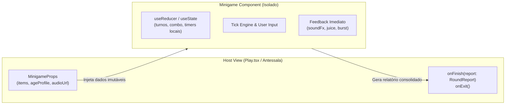

# ESPECIFICAÇÃO TÉCNICA (OPEN SPEC): NOVOS MINIGAMES CULTURAIS
**Módulo:** `@core/minigames` & `src/components/minigames/`  
**Branch de Trabalho:** `feature/minigames-prototypes`  
**Autor:** Engenharia de Front-end & Arquitetura de Games  
**Status:** Proposto / Em Desenvolvimento  

---

## 1. VISÃO GERAL E OBJETIVO ARQUITETURAL

O objetivo desta especificação é formalizar o contrato técnico, os modelos de dados e os loops de gameplay para a nova geração de minigames do Babel Play, inspirados no Dossiê de Gamificação Cultural e Aquisição de Segunda Língua (SLA).

Cada minigame deve ser desenvolvido como um **componente totalmente desacoplado**, que não polui o estado global da aplicação, consome e reporta dados através do contrato canônico `MinigameItem` / `RoundReport`, e adere estritamente ao Design System e aos perfis etários (`kids`, `pro`, `senior`).

---

## 2. ARQUITETURA DE COMPONENTES E ISOLAMENTO DE ESTADO

### 2.1 Princípio de Não-Vazamento (Zero State Leakage)
Nenhum minigame manipula diretamente stores globais ou persistência de dados durante a execução do jogo. A comunicação é unidirecional e encapsulada:



### 2.2 Contrato Universal de Props (`MinigameProps`)
Todos os novos minigames implementam a seguinte interface base:

```typescript
export interface BaseMinigameProps<TItem = MinigameItem> {
  items: TItem[];
  ageProfile: AgeProfileType; // 'kids' | 'pro' | 'senior'
  audioUrl?: string | null;
  onFinish: (report: RoundReport) => void;
  onExit: () => void;
}
```

Ao sair prematuramente (`onExit`), nenhuma alteração no agendador de repetição espaçada (FSRS) é gravada. Ao concluir (`onFinish`), o componente emite um `RoundReport` padronizado, delegando a tela hospedeira a responsabilidade de conceder XP, seeds e atualizar o histórico de itens.

---

## 3. DATA MODELS & TIPAGEM DOS NOVOS JOGOS

### 3.1 Karuta ("Audio-Slap Reflex")
Inspirado na tradição japonesa do *Iroha Karuta*, focado no treinamento fonético e no reconhecimento auditivo ultrarrápido (*Kimariji*).

```typescript
export interface KarutaCard {
  id: string;
  itemRef: string;
  cardId?: string;
  /** Texto impresso na carta (palavra no idioma alvo ou ideograma) */
  targetText: string;
  /** Pista ou tradução de suporte */
  prompt: string;
  /** Leitura fonética (ex: Hiragana, Pinyin ou IPA) */
  phonetic?: string;
  /** Posição na mesa (x, y normalizados de 0 a 1) */
  x: number;
  y: number;
  rotation: number;
  /** Estado da carta na rodada */
  status: 'idle' | 'correct' | 'wrong' | 'removed';
}

export interface KarutaRoundState {
  currentAudioIndex: number;
  activeCard: KarutaCard;
  displayedCards: KarutaCard[];
  roundStartTime: number;
  audioStartTime: number;
  streak: number;
  score: number;
}
```

### 3.2 Ich packe meinen Koffer ("Mala Infinita Gramatical")
Inspirado na tradição alemã do jogo da mala, focado na memorização sequencial e na declinação automática de artigos e casos gramaticais (Acusativo: *den/die/das* ou *einen/eine/ein*).

```typescript
export type GrammaticalGender = 'masculine' | 'feminine' | 'neuter' | 'plural';
export type GrammaticalCase = 'nominative' | 'accusative' | 'dative' | 'genitive';

export interface KofferItem {
  id: string;
  itemRef: string;
  cardId?: string;
  name: string; // ex: "Koffer", "Brille", "Buch"
  translation: string; // ex: "mala", "óculos", "livro"
  gender: GrammaticalGender;
  iconName?: string;
  /** Artigo correto no caso exigido na rodada */
  correctArticle: string; // ex: "einen", "eine", "ein"
  distractorArticles: string[]; // ex: ["ein", "eine"] quando a resposta é "einen"
}

export interface KofferRoundState {
  sequence: KofferItem[]; // Itens acumulados na mala até o momento
  step: 'playback' | 'recall_sequence' | 'choose_article' | 'round_success' | 'game_over';
  currentRecallIndex: number;
  selectedItemForArticle: KofferItem | null;
  score: number;
  lives: number;
}
```

### 3.3 Choseong Game ("Decifrador de Consoantes Iniciais")
Inspirado no jogo coreano 초성게임, focado no resgate lexical rápido através de pistas consonantais ou radicais.

```typescript
export interface ChoseongPuzzle {
  id: string;
  itemRef: string;
  cardId?: string;
  consonants: string; // ex: "ㅎㅅ" (para 회사 / 호수) ou "C_T" para línguas latinas
  targetWord: string;
  translation: string;
  category: string; // ex: "Lugares", "Comida", "Profissões"
  hintSentence?: string;
  distractorVowels?: string[];
}

export interface ChoseongRoundState {
  puzzles: ChoseongPuzzle[];
  currentIndex: number;
  inputBuffer: string;
  timeLeftMs: number;
  streak: number;
  score: number;
}
```

### 3.4 Taboo Arena ("Forja da Circunlocução")
Inspirado no clássico jogo de palavras proibidas, focado no desenvolvimento da competência estratégica e na paráfrase.

```typescript
export interface TabooCard {
  id: string;
  itemRef: string;
  cardId?: string;
  targetWord: string;
  translation: string;
  forbiddenWords: string[]; // 4 a 5 termos tabu
  category: string;
  clues: string[]; // Pistas aceitáveis / sugestões
}

export interface TabooRoundState {
  cards: TabooCard[];
  currentIndex: number;
  timeRemainingS: number;
  score: number;
  revealedHints: number;
  tabooViolated: boolean;
}
```

---

## 4. GAME LOOP & MOTOR DE REGRAS

### 4.1 Ciclo de Vida Padrão de uma Partida
1. **Fase de Inicialização:** Carrega itens, calcula tempos pelo perfil etário (`kids` = 1.5x tempo, `senior` = 1.5x tempo e fontes maiores, `pro` = tempo padrão competitivo), prepara assets sonoros.
2. **Fase de Ação:** O jogador interage com o elemento central (toque, digitação ou seleção de cartas).
3. **Avaliação e Feedback Imediato (< 16ms):**
   * Se correto: dispara `play('correct')`, feedback visual háptico/squash, pontuação com combo multiplicador e partículas `emitBurst()`.
   * Se incorreto: dispara `play('wrong')`, tremor de tela `tremor()`, reset de combo e registro do erro em `ItemOutcome`.
4. **Fase de Desfecho:** Cálculo de estrelas, tempo total decorrido e envio do `RoundReport` via callback `onFinish`.

### 4.2 Matriz de Pontuação e FSRS Compatibility
* Cada item respondido de primeira em tempo ótimo (< 2000ms) recebe nota FSRS **4 (Fácil)**.
* Resposta correta com tempo intermediário recebe nota FSRS **3 (Bom)**.
* Resposta com uso de dica/tempo esgotando recebe nota FSRS **2 (Difícil)**.
* Erro ou revelação recebe nota FSRS **1 (Errou)**.

---

## 5. DESIGN SYSTEM & POLÍTICA DE ACESSIBILIDADE

* **Tokens Visuais:**
  * Fundo da mesa de jogo: `bg-surface` com borda sutil `border-border-subtle`.
  * Botões e cartas interativas: sombras táteis (`shadow-card`), cantos arredondados (`rounded-xl` / `rounded-2xl`).
  * Cores Semânticas: Sucesso (`--good`), Alerta de tempo (`--warn`), Erro (`--error`), Destaque/Fever (`--accent`).
* **Acessibilidade:**
  * Total suporte a navegação por teclado (Enter, Espaço, Setas e números 1-4 para alternativas).
  * Textos com alto contraste usando `--ink` e `--ink-muted`.
  * Respeito irrestrito a `prefers-reduced-motion` e `.animations-off`.
