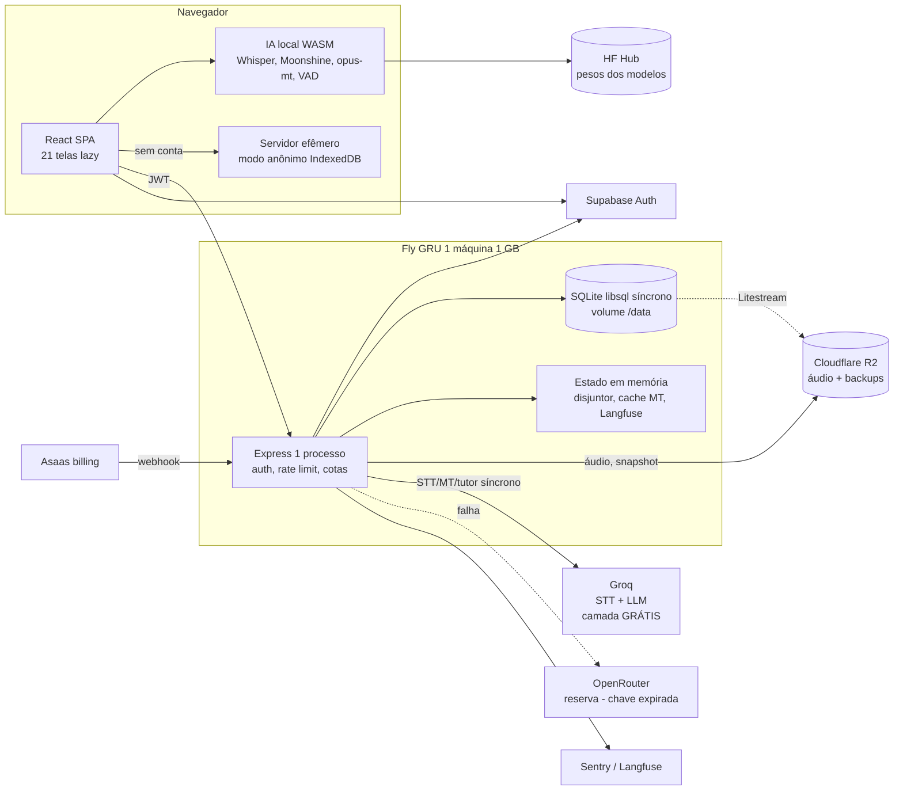

# Prontidão para produção — Fase 1: mapeamento (25/09/2026)

Branch `auditoria/prontidao-producao`, base `cf56e10`. Somente leitura: nenhum código foi alterado nesta fase.
Método: quatro frentes em paralelo (backend/banco, IA/custo, frontend, infra/CI), cada afirmação com
`arquivo:linha`; os achados P0 foram reconferidos à mão depois (marcados ✔).

## 1. Inventário

| Camada | O que é hoje | Evidência |
|---|---|---|
| Hospedagem | Fly.io, região `gru`, **1 máquina** `shared-cpu-1x` **1 GB**, sempre ligada, concorrência 200/250 | `fly.toml:15-16,64-71,83-85` |
| Processo | **1 processo Node** (cluster só com `CLUSTER_WORKERS>1`, não definido); sem `worker_threads` | `server.ts:387-486`; `.env.production.example:189` |
| HTTP | Express 4 + helmet + compression (gzip) + express-rate-limit | `server/http/app.ts:26-30,182` |
| Banco | **SQLite** via `@libsql/client` 0.17.4 → driver `libsql` **síncrono**; WAL, `busy_timeout=5000`; 1 conexão; 30 migrations só para frente, rodadas no boot | `server/db/db.ts:11-33,77-80`; `node_modules/@libsql/client/lib-esm/sqlite3.js:1,71-83`; `server.ts:197-204` |
| Backup | Litestream → R2 (RPO ~1 s) + snapshot diário no processo (`VACUUM INTO` + `gzipSync`) | `litestream.yml:19-34`; `server/operacao/snapshot.ts:109-128` |
| Arquivos | Interface única: disco local ou S3/R2 (com as 4 `S3_*`); cota de armazenamento atômica; retenção de áudio 90 dias | `server/lib/armazenamento.ts:219-236`; `storageQuota.ts:117-128`; `retencaoDeAudio.ts` |
| Auth | Supabase (JWT Bearer, JWKS, `exp` obrigatório); sem sessão no servidor; AAL2 via Admin API | `server/lib/auth.ts:101-152`; `aal.ts:33-124` |
| Rate limit | Contadores **no SQLite** (`usage_counters`): 60/min rotas caras por usuário, 120/min escrita, 30/15 min falha de login por IP | `rateLimitStore.ts:74-119`; `app.ts:219-255,353-366` |
| Cotas | Por plano, no servidor, atômicas (upsert com `setWhere`), janela **mês-calendário UTC**; orçamento global de IA **mensal** (padrão US$ 20) | `usageCounters.ts:58-74`; `usageQuota.ts:51-53`; `config.ts:808-821` |
| IA nuvem | Groq (STT whisper-large-v3-turbo, LLM gpt-oss-120b) → reserva OpenRouter (chave **expirada**); disjuntor só no LLM | `server/ai/provedores.ts:17,64-110`; `cascata.ts`; `disjuntor.ts` |
| IA navegador | Whisper tiny/base/small, Moonshine, opus-mt, VAD Silero — custo zero no servidor; pesos do HF Hub por padrão | `src/gateway/sttRouter.ts:54-97`; `transformersEnv.ts:23-43` |
| Filas / workers | **Nenhuma.** Toda IA é síncrona dentro do request | grep por p-limit/bull/worker em `server/` vazio |
| Cache | Em memória por processo: tradução (LRU 2.000, 24 h), AAL (60 s), JWKS | `cacheDeTraducao.ts:34-91`; `aal.ts:46-48` |
| Observabilidade | Logger JSON próprio + Sentry por envelope + Prometheus (desligado em prod) + Langfuse (desligado sem chaves) | `logger.ts`; `sentry.ts`; `metricas.ts:235`; `.env.production.example:169-176` |
| CI/CD | `ci.yml` completo (tsc, lint, vitest, e2e, build, imagem, restauração Litestream); `deploy.yml` **manual e sem gate de CI** | `.github/workflows/ci.yml:8-265`; `deploy.yml:26-95` |
| Modo sem login | **Já existe** um modo anônimo 100% no navegador (IndexedDB), sem IA de nuvem, teto 5 sessões/80 palavras, migração no login | `src/data/funil.ts:42-43`; `src/core/tetoAnonimo.ts:22-27`; `useGateDeConta.ts:31-40` |

## 2. Diagrama

## 3. Fluxos críticos

M = custo fixo de todo request autenticado: **3–7 queries e 2–3 escritas antes do handler**
(limitador de IP grava e estorna, conta suspensa, `exigirContaLiberada`, `writeLimiter`) — `app.ts:246-255,353-366`; `auth.ts:210-225`; `idade.ts:115-130`.
Todo acesso ao banco **bloqueia o event loop** (driver síncrono).

| Fluxo | Rota | Queries/req | Externas | Payload | Bloqueio síncrono | Compartilhado | Gargalo (evidência) |
|---|---|---|---|---|---|---|---|
| Login / 1º acesso | `GET /api/me/entitlements` | M + 3–5 + reconciliação a cada 24 h com **1 HEAD no R2 por arquivo, em série** | Supabase JWKS, R2 | pequeno | driver | — | laço de HEAD no request (`storageQuota.ts:283-305`) |
| Transcrição | `POST /api/ai/stt` | M + entitlement + orçamento + (plano + reserva)×2–3 + gasto | Groq 30 s × 3 tentativas (≤92 s) | até **25 MB em memória** | — | orçamento global, **conta Groq única** | sem disjuntor, sem reserva, retry triplica o 429 (`sttProxy.ts:28,189,263-274`) |
| Tradução | `POST /api/ai/mt` | idem | Groq → OpenRouter, 12 s por perna | ≤4.000 caracteres | — | cache MT por processo, conta Groq | cliente desliga a nuvem na sessão com qualquer 5xx (`serverLlmMt.ts:44-46`) |
| Tutor | `POST /api/tutor/chat` | idem | cascata 30 s por perna | ≤16.000 caracteres | — | conta Groq | ~4.200 tokens/pergunta no pior caso |
| Montar rodada | `montarRodada` no **cliente** (`src/core/minigames/rodada.ts:172`); servidor `/api/vocab/para-jogo` | M + 2 (`cortesDeFaixa` varre o baralho) | — | ≤200 itens | driver | — | O(baralho) por rodada (`vocab.ts:739-751`) |
| Baralho | `GET /api/vocab` | M + 3 **sem LIMIT** | — | **1,65–2,27 MB** | `JSON.stringify` | — | chamado de **16 módulos** do cliente sem cache (`vocab.ts:259-291`) |
| Revisão FSRS | `POST /api/vocab/:id/review` | M + 5 (get, UPDATE, INSERT, get, procedência) | — | pequeno | — | — | ler-e-regravar: revisões simultâneas perdem atualização (`vocab.ts:1092-1130`) |
| Loja | `POST /api/metrics/seeds/gastar` | M + **~24** | — | pequeno | 11 varreduras sem LIMIT | — | débito atômico OK (`seedSpends.ts:84-91`), custo O(histórico) (`metrics.ts:137-170`) |
| Equipar cosmético | `PUT /api/settings` | M + **até 98** | — | ≤100 KB | idem | — | mesma leitura cara em laço (`settings.ts:29-32`) |
| Estatísticas | `GET /api/metrics/profile` | M + 11 sem LIMIT | — | médio | lê **todas** as falas | — | 41,8 ms de CPU/chamada medidos em 09/09 (`metrics.ts:55-128`) |
| Salvar sessão | `POST /api/sessions` | M + 1–3, INSERT em batch | — | ≤5 MB, ≤5.000 falas | — | — | **bug: >1.927 falas estoura 32.766 variáveis** (`utterances.ts:27-49`, `validation.ts:85,93`) |
| Áudio da sessão | `POST /api/sessions/:id/audio` | M + ~7 | PUT no R2 **sem timeout** | **120 MB em memória** | sha256 do corpo todo | — | memória (`sessions.ts:206`; `armazenamento.ts:111,161`) |
| Importar Anki | `POST /api/import/anki` | M + 6 + **1 escrita por nota, até 50.000** | — | **200 MB + 300 MB de expansão** | `zstdDecompressSync` | — | **bug: >32.766 notas estoura variáveis**; sem checagem de plano (`import.ts:253`; `repositories/anki.ts:300,397`) |
| Ranking | `GET/POST /api/rank/:jogo` | 1 / M + 2 | — | pequeno | — | **global** | trava 1/min com corrida (`rank.ts:83-88`) |
| Webhook billing | `POST /api/billing/webhook/asaas` | 3–6, idempotente | Asaas (re-fetch) | 100 KB | — | — | OK |
| Backup diário | timer 6h UTC | `VACUUM INTO` + `integrity_check` | R2 | banco inteiro | **`gzipSync` level 9 no event loop** | — | servidor para durante o backup; health timeout 5 s (`snapshot.ts:117-120`; `fly.toml:81`) |

## 4. Estado que não sobrevive a mais de uma réplica

Disjuntor (`disjuntor.ts:61`), cache de tradução (`cacheDeTraducao.ts:91`), cache AAL (`aal.ts:48`), contas conhecidas
(`abertura.ts:40`, nunca invalida), fila Langfuse (`langfuse.ts:372`), aviso de 429 (`telemetriaDeIa.ts:110`),
métricas Prometheus (`metricas.ts:120`), diário de erros em disco (`diarioDeErros.ts:106-118`), timers de snapshot e
retenção (`server.ts:323-348`) e — o principal — **o próprio SQLite**: rate limit, cotas, orçamento e ranking ficam
num arquivo local. Duas máquinas = dois bancos divergentes (`fly.toml:3-6`). A trava de boot contra multi-réplica só
olha o armazenamento de áudio (`diretorios.ts:61-71`), então `REPLICAS=2` com `S3_*` passa.

**P0 antigos reconferidos:** concorrência SQLite, áudio preso a uma réplica (com `S3_*`) e estouro de cota
**não regrediram** (`db.ts:70-82`; `armazenamento.ts:219-236`; `usageCounters.ts:58-74`). Resíduo: o orçamento
global de IA confere antes e soma depois, então chamadas simultâneas passam do teto (`orcamentoDeIa.ts:101-129`).

## 5. Lacunas encontradas (preliminar; a Fase 2 mede e prioriza)

### P0 — quebra ou vaza custo em produção
| # | Achado | Evidência |
|---|---|---|
| P0-1 | **Um usuário derruba o serviço por memória**: corpos de 200 MB (+300 MB de expansão), 120 MB e 25 MB lidos inteiros numa VM de 1 GB, sem limite de simultaneidade por usuário; é a única máquina ✔ | `import.ts:253`; `import/anki.ts:346`; `sessions.ts:206`; `ai.ts:24`; `fly.toml:83-85`; `app.ts:233-237` |
| P0-2 | **Cota de STT forjável**: duração vem do `byteRate` do cabeçalho WAV, que o cliente escolhe; corpo não-RIFF conta 10 s fixos até 25 MB ✔ | `server/lib/duracaoDeAudio.ts:49,59-61,88`; `ai.ts:24` |
| P0-3 | **Cliente escolhe o modelo no caminho pago pelo app** (`x-model` sem lista permitida): whisper-large-v3 leva o Essencial a ~R$ 20 de custo contra R$ 17,62 líquidos ✔ | `sttProxy.ts:154`; `validation.ts:730-741` |
| P0-4 | **Capacidade de IA = 2 a 4 pessoas falando ao mesmo tempo**, ~450 traduções/dia para o app todo (Groq grátis, conta única) e reserva expirada; orçamento padrão US$ 20 fecha a nuvem para todos com ~8 assinantes no pior caso | `bancada-2026-09.md:130-131`; `config.ts:808`; `orcamentoDeIa.ts:108` |
| P0-5 | **Deploy sem gate de CI**: `deploy.yml` implanta qualquer ref | `deploy.yml:26-95` |
| P0-6 | **Sem alerta de erro/latência e métricas não coletadas em produção**; restauração nunca testada em produção | `.env.production.example:175`; `fly.toml:87-89`; `runbook.md:112` |
| P0-7 | **API sem 404 JSON e sem versão**: rota `/api` removida devolve `index.html` com 200; aba antiga não detecta deploy novo ✔ | `server/http/estaticos.ts:55-58`; grep `APP_VERSION` vazio |

### P1 — degrada com escala
Event loop travado (driver síncrono + backup `gzipSync` no processo) · sessão >1.927 falas e Anki >32.766 notas falham ·
consultas em laço (`PUT /settings` até 98, `seeds/gastar` ~24, `profile` lê todo o histórico) · `/api/vocab` 2 MB sem
paginação chamado de 16 módulos sem cache · rate limit grava 2× por request no único escritor · falha do R2 tira a única
máquina do ar (`/api/ready` inclui R2) · STT sem disjuntor e sem respeitar `Retry-After` · 5xx passageiro desliga a nuvem
de quem paga · revisão FSRS não atômica · sem `unhandledRejection`/teto de heap · migrations destrutivas no boot sem gate
expand/contract (e snapshots drizzle faltando para 0023, 0025–0029) · WASM com 1 thread no Fly (sem `CROSS_ORIGIN_ISOLATION`) ·
pesos dos modelos do HF Hub sem `storage.persist()` · `ort-wasm-*` imutável por 1 ano sem hash · sem feature flags remotas ·
sem alerta de custo diário · polling de 5 s sem teto no checkout · Lighthouse e k6 fora do CI (k6 só sem auth).

### P2 — melhoria
Timeouts HTTP padrão do Node e S3/Admin API sem timeout · listagens sem LIMIT · índices faltando
(`exercise_results(user_id, created_at)`, `usage_counters(metric, window)`) · caches e disjuntor por processo ·
cota pelo mês UTC e não pelo ciclo pago · sem tag semver, CHANGELOG parado, versão fora do `/health` · sem ADR de
banco/infra e `decisao-infraestrutura-v1.md` contradiz o implantado · `ASAAS_WEBHOOK_TOKEN` não conferido no boot ·
mídia no R2 sem backup · sem trivy/SBOM · `prototipo-consistencia.html` e `lucide.min.js` publicados · só gzip ·
perfil "Privado/Local" usa MyMemory e Web Speech (terceiros).

## 6. Premissas a confirmar no gate

1. **Topologia alvo.** Hoje é 1 máquina + SQLite. Escalar horizontalmente exige banco compartilhado (Postgres/Turso) —
   decisão da Fase 2 (ADR), com o ponto de virada medido.
2. **Modo convidado.** Já existe um modo anônimo local, sem nuvem. A Fase 7 vai **estendê-lo** (identificador anônimo no
   servidor, cota de IA pequena, antiabuso), não criar do zero.
3. **Hipótese de concorrência** para as Fases 2–4: 10% dos usuários ativos no pico, 30% deles capturando áudio.
4. **Groq Developer indisponível**: tratado como restrição. Tudo que depende do upgrade vai para pendências.
