# Auditoria de latência da legenda: da captura à tela

**Data:** 26/09/2026. **Branch:** `auditoria/latencia-legenda`, criada de `main` em `b8085b5`. **Alvo:** edição estática (`npm run build:estatica`), servida por `tests/e2e-estatica/_servidor-estatico.mjs` com COOP/COEP, como no Pages. Em todas as rodadas `crossOriginIsolated` foi `true`.

**Máquina:** Ryzen 5 5600 (12 threads lógicas; `hardwareConcurrency` = 12), 16 GB de RAM, RX 6800. O adaptador WebGPU se identificou como `amd rdna-2`. Navegador: Chromium 151 do Playwright, com interface (headful) e sem interface (headless shell).

**Código de produção:** nenhuma linha foi alterada. As marcas de tempo vêm de um script injetado de fora, `scripts/perf/latencia-legenda/sonda.js`. Ele envolve `Worker`, `fetch`, `getUserMedia`/`getDisplayMedia` e o Chrome Translator, observa o DOM e lê o `window.__capMetrics()` que o app já expõe.

## Resposta curta

No regime estável, com o padrão da edição estática nesta máquina (Whisper **small** no WebGPU, opus-mt no WASM), a legenda traduzida da **sua fala** (pt→en) aparece **2,5 s (p50) / 3,2 s (p95)** depois que você para de falar.

Esses 2,5 s se dividem em três partes:

- **VAD fecha a fala: 0,78 s.** É o `redemptionMs` de 800 ms, uma espera fixa.
- **Transcrição final: 1,33 s.** Deste total, **0,92 s (p50) / 1,71 s (p95)** é espera: o decode final roda **ao mesmo tempo** que um decode PARCIAL da mesma fala, que ainda não terminou. Isso aconteceu em **20 de 22** falas.
- **Tradução: 0,47 s.**

O React e a tela não pesam. Da resposta do worker ao texto no DOM levam de 1 a 8 ms (p50).

**O gargalo é o STT final, e a maior parte dele não é o modelo.** O parcial da mesma fala disputa o worker com o final. Com os parciais desligados (o "Modo desempenho" que já existe), o STT final caiu de 1,33 para 1,02 s, e a legenda traduzida caiu para 2,19 s (p50) / 2,54 s (p95).

Três achados são mais graves do que a latência em si. Todos foram medidos:

1. **`navigator.gpu` existe, mas não há adaptador:** a captura **nunca mostra legenda**. O roteador escolhe o small pelo `!!navigator.gpu`, o worker falha com "no available backend found" e a preparação do modelo termina em erro. As 12 falas ficaram guardadas para sempre (headless desta máquina).
2. **Whisper small cai para WASM:** a legenda chega **18,6 s (p50) / 24,5 s (p95)** depois da fala, e o atraso cresce a cada frase (fila; RTF > 1).
3. **"Eu falo: Detectar" no microfone:** o Whisper recebe fala em português sem idioma e **devolve inglês** como se fosse o "original". Não há parcial e não há tradução. É o bug de idioma que outro agente está corrigindo; o efeito na latência está registrado abaixo.

## Como foi medido

- **Áudio.** Fala real do FLEURS (`%LOCALAPPDATA%/babel-bancada/stt/fleurs_{pt,en}`, a mesma da bancada de 2026-09).
  - 12 falas por idioma, com 2 a 5,8 s de voz: é um turno de conversa, abaixo do corte forçado de 6 s.
  - Os clipes foram aparados na voz e normalizados para RMS −20 dBFS. Parte do FLEURS vem a −38 dBFS de pico, e nesse nível o Silero perdia o começo das frases na primeira rodada de teste.
  - Entre as falas há pausas de 1,2 / 1,6 / 2,0 / 2,4 s, e antes da primeira fala há 30 s de silêncio e um bipe de 2 kHz.
  - Montagem: `montar-audio.mjs`. Roteiros em `dados/roteiro-{pt,en}.json`.
- **Entrada.** O Chromium toca o WAV como microfone falso (`--use-file-for-fake-audio-capture=…%noloop`).
  - **Modo mic:** "Local (offline)", microfone ativo, cenário conversa. O `getDisplayMedia` é recusado, e a sessão segue só com o mic, como quando a pessoa fecha a caixa de compartilhamento.
  - **Modo sistema:** o `getDisplayMedia` devolve o mesmo áudio sem o DSP de chamada, com o cenário mídia.
  - Idiomas, motor do mic e "Modo desempenho" são configurados **pela interface** (`medir.mjs`).
- **Relógio.**
  - A sonda pendura um AudioWorklet no stream que o app recebe e acha o bipe por Goertzel. Com isso, o "fim da voz no arquivo" vira `performance.now()` da página, com erro de ±20 ms.
  - O fim da voz é medido por energia. Em algumas falas em inglês ele inclui respiração no final. Por isso a coluna "VAD fecha" do modo sistema fica abaixo de 800 ms (p50 0,46–0,53 s) e tem alguns valores negativos. No modo mic, que tem AGC, ela fica em 0,75–0,78 s, o esperado para `redemptionMs` 800.
- **Amostra.** 2 rodadas × 12 falas por configuração principal, descartando a 1ª fala de cada rodada (aquecimento). Resultam 22 falas.
  - As configurações secundárias têm 1 rodada (11 falas).
  - p50/p95 por interpolação linear. Com n = 22, o p95 fica entre os dois maiores valores e deve ser lido como "pior caso típico", não como cauda estável.
- **Perfil do navegador.**
  - **Primeira carga:** perfil vazio (download e compilação).
  - **Regime estável:** o mesmo perfil, com os pesos no Cache Storage.
  - Armadilha encontrada: com o perfil num caminho longo (> MAX_PATH do Windows), o Cache Storage do Chromium falha ("Unexpected internal error") e **todo modelo é baixado de novo a cada sessão**. As rodadas usam `%TEMP%\latp\cr`.
- **Reproduzir:**
  ```
  npm run build:estatica && node tests/e2e-estatica/_servidor-estatico.mjs 4176
  node scripts/perf/latencia-legenda/montar-audio.mjs --idioma pt --saida <dir>   (e --idioma en)
  node scripts/perf/latencia-legenda/rodar-matriz.mjs --audio-dir <dir> --perfil %TEMP%\latp\cr --saida <rodadas> [--repeticoes 2]
  node scripts/perf/latencia-legenda/tabela.mjs <rodadas> --pular 1
  ```
  Os dados condensados de cada configuração, fala a fala, estão em `dados/*.json`.

## O pipeline, com arquivo:linha

```mermaid
flowchart LR
  A["getUserMedia (mic, AEC/NS/AGC ligados)<br/>systemAudio.ts:628-635<br/>ou getDisplayMedia (sistema, DSP desligado)<br/>systemAudio.ts:140-152"] --> B["Silero VAD (MicVAD, worklet + ORT)<br/>redemption 800 ms, pré-fala 300 ms, mín. 400 ms<br/>systemAudio.ts:338-398"]
  B -- "a cada 1,1 s durante a fala<br/>(buffer INTEIRO até agora)<br/>systemAudio.ts:413-420" --> P["parcial: transcribeIfIdle<br/>whisperLocal.ts:182-190<br/>pipelineDeFala.ts:255-300"]
  B -- "fim da fala / corte de 6 s<br/>systemAudio.ts:391-397, 372-383" --> F["final: transcribePcm<br/>pipelineDeFala.ts:303-449"]
  P --> W["UM worker de STT<br/>(Whisper tiny/base/small ou Moonshine)<br/>onmessage async = decodes INTERCALADOS<br/>whisperWorker.ts:197-272"]
  F --> W
  W -- "update por token → setState<br/>pipelineDeFala.ts:442-448" --> R["React: setSpeechSegments<br/>ChatTranscript.tsx:221-290"]
  W -- "resultado + filtro de alucinação<br/>whisperWorker.ts:263-271" --> M["translateSegment<br/>traducaoDaFala.ts:118-304"]
  M --> G["gateway.mt: chrome-translator → opus-mt → (server-llm) → MyMemory<br/>profiles.ts:34, index.ts:175-204"]
  G --> O["UM worker opus-mt (WASM, beam 2, uma chamada por frase)<br/>mtWorker.ts:97, 130-191"]
  O --> R
```



Como cada etapa funciona:

- **Captura.**
  - No mic, `echoCancellation/noiseSuppression/autoGainControl: true` (`systemAudio.ts:628-635`).
  - No sistema, os três ficam `false` (`systemAudio.ts:140-152`).
  - Um `MediaRecorder` grava em paralelo, fora do caminho da legenda (`systemAudio.ts:208-216`).
- **VAD.**
  - Configuração em `systemAudio.ts:338-398`: `redemptionMs: 800` (`:355`), `preSpeechPadMs: 300` (`:356`), `minSpeechMs: 400` (`:357`).
  - Teto de fala contínua de 6 s no local (`MAX_SPEECH_MS_LOCAL`, `:59`; corte em `:372-383`).
  - Na medição, o fechamento ficou em **0,78 s p50 / 0,83 s p95** depois do fim da voz, no mic.
- **Parciais.**
  - Um `setInterval` de 1,1 s (`PARTIAL_INTERVAL_MS`, `:178`) exige ≥ 0,6 s de áudio novo (`:180`) e manda o **buffer inteiro desde o início da fala** (`concatFrames`, `:305-313, 413-420`). Cada parcial re-decodifica tudo, e o custo cresce com a fala. Foram 3,5–4,0 parciais por fala.
  - O descarte só acontece se o worker já estiver ocupado **no instante do tick** (`whisperLocal.ts:188`).
- **Final.**
  - `onUtterance` posta direto ao worker (`whisperLocal.ts:397-418`), sem esperar o parcial em voo.
  - O worker usa `self.onmessage = async` (`whisperWorker.ts:197`): a segunda mensagem começa enquanto a primeira espera dentro de `asr()`. Os dois `generate` **se intercalam** token a token.
  - Evidência (`frio2`, fala 2): o parcial foi postado em 48 032 ms e o final em 48 202 ms. O 1º token do final saiu em 48 729 ms, **antes** do resultado do parcial (49 708 ms), e os dois terminaram juntos (final em 49 833 ms). O parcial devolveu exatamente o mesmo texto do final.
- **Streaming do final.** Cada token vira `postMessage('update')` (`whisperWorker.ts:212-219`) e um `setSpeechSegments` que re-renderiza a lista inteira (`pipelineDeFala.ts:442-448`).
- **Tradução.**
  - Ao chegar o final, `translateSegment` pede a MT na hora (mtEspera p50 = 0–1 ms; `pipelineDeFala.ts:619-631`).
  - O parcial também traduz (`pipelineDeFala.ts:289-295`); só é pulado se já houver MT em voo para o mesmo balão (`traducaoDaFala.ts:129`).
  - A cadeia começa no **Chrome Translator** (`profiles.ts:34`), que consulta `Translator.availability()` **a cada chamada, sem prazo** (`chromeTranslator.ts:62`). Depois vem o opus-mt no worker WASM, com beam 2 e uma chamada por frase (`mtWorker.ts:97, 186`).
  - O worker de MT também é `onmessage = async` (`mtWorker.ts:130`): a tradução do parcial e a do final se intercalam.
  - Se a MT de um parcial com texto idêntico ao final já terminou, o cache devolve na hora (`traducaoDaFala.ts:227`). Isso aconteceu em 2–3 de 22 falas.
- **Tela.** `ChatTranscript` redesenha todos os balões a cada mudança (`ChatTranscript.tsx:221-290`). O waveform faz `setLevels` a 20 fps na raiz da tela (`LiveCapture.tsx:888-892`), o que re-renderiza o `LiveCapture` inteiro. **Medido, isso não pesa:**
  - texto final do worker ao DOM em 2–5 ms (p50);
  - atraso máximo do laço de eventos durante a conversa entre 51 e 83 ms;
  - Long Animation Frames somando de 0,4 a 1,5 s em ~100 s de sessão.
- **Espera fixa fora do caminho.** A tradução tem um prazo de 8 s até degradar (`traducaoDaFala.ts:262`). Não houve debounce nem timer no caminho quente além do VAD e do tick de 1,1 s.

## Tabela de latência (regime estável, headful)

Em ms, **p50 / p95**. "FIM" é o fim da voz no arquivo, e o destino é o texto no DOM (commit do React).

| Configuração | STT · backend | n | STT pronto¹ | início → 1º texto | VAD fecha | espera pelo parcial | STT final | MT | **FIM → original** | **FIM → tradução** |
|---|---|---|---|---|---|---|---|---|---|---|
| **mic pt→en, padrão** | whisper-small · webgpu | 22 | 11 458 / 11 556 | 2 645 / 3 432 | 781 / 830 | 915 / 1 707 | 1 329 / 1 796 | 466 / 849 | **2 097 / 2 561** | **2 524 / 3 204** |
| mic pt→en, sem parciais (Modo desempenho) | whisper-small · webgpu | 11 | 8 841 | — (sem parcial) | 781 / 824 | 0 / 0 | 1 022 / 1 230 | 393 / 562 | 1 807 / 2 028 | 2 187 / 2 543 |
| mic en→pt, padrão | whisper-small · webgpu | 22 | 13 114 / 5 673 | 1 862 / 2 331 | 477 / 722 | 843 / 2 060 | 1 391 / 2 226 | 722 / 1 434 | 1 893 / 2 805 | 2 428 / 4 283 |
| mic pt→en, base | whisper-base · webgpu² | 22 | 4 306 / 3 963 | 2 259 / 3 275 | 771 / 829 | 319 / 1 066 | 821 / 1 127 | 437 / 703 | 1 566 / 1 895 | 1 925 / 2 483 |
| mic pt→en, tiny ("rápido") | whisper-tiny · webgpu | 22 | 2 932³ | 2 358 / 3 130 | 757 / 830 | 0 / 1 143 | 619 / 1 226 | 488 / 735 | 1 398 / 1 977 | 1 888 / 2 724 |
| mic pt→en, base WASM | whisper-base · wasm (4 threads) | 11 | 15 061³ | 5 275 / 6 005 | 770 / 852 | 1 553 / 1 915 | 3 749 / 4 204 | 392 / 574 | 4 577 / 5 040 | 4 810 / 5 512 |
| **mic pt→en, small WASM** | whisper-small · wasm | 11 | 14 732 | — | 771 / 811 | 8 987 / 14 521 | 17 240 / 23 211 | 365 / 709 | **18 041 / 23 972** | **18 597 / 24 453** |
| sistema en→pt (Moonshine) | moonshine-base q8 · wasm | 22 | 3 552 / 3 794 | 1 680 / 3 062 | 491 / 760 | 0 / 469 | 840 / 1 389 | 566 / 927 | 1 275 / 1 893 | 1 776 / 2 789 |
| sistema en→pt, sem parciais | moonshine-base q8 · wasm | 11 | 3 609 | — | 530 / 781 | 0 / 0 | 478 / 631 | 530 / 752 | 1 010 / 1 342 | 1 516 / 2 071 |
| sistema "Detectar" → pt (padrão da tela) | whisper-small · webgpu | 22 | 6 066 | 2 451 / 2 808⁴ | 461 / 722 | 0 / 1 978 | 1 013 / 2 039 | 545 / 1 211 | 1 455 / 2 601 | 1 971 / 3 786 |
| mic "Eu falo: Detectar" (pt) | whisper-small · webgpu | 11 | 6 307 | — (sem parcial) | 750 / 836 | 0 / 0 | 979 / 1 065 | — (sem MT)⁵ | 1 681 / 1 858 | — |
| sistema en→pt, **headless** | moonshine-base q8 · wasm | 11 | 3 440 | 1 763 / 2 437 | 481 / 762 | 161 / 539 | 961 / 1 578 | 790 / 1 082 | 1 417 / 2 155 | 2 233 / **8 438**⁶ |
| **mic pt→en, headless (padrão)** | small → WebGPU sem adaptador | 12 | **falhou** | — | — | — | — | — | **nenhuma legenda** | **nenhuma legenda** |

Notas da tabela:

1. "STT pronto" é o tempo do clique em "Iniciar captura" até o worker responder `ready`, com o modelo já no Cache Storage. Inclui criar a sessão ONNX e o aquecimento (`whisperWorker.ts:172-191`). Os valores são das rodadas r1 e r2.
2. `--sem-webgpu` esconde `navigator.gpu` só da janela: o roteador passa a escolher base, mas o worker ainda vê a GPU e roda no WebGPU.
3. Foi a primeira carga daquele modelo nesse perfil (inclui download).
4. No "Detectar", os parciais ficam **desligados** até o perfil de idioma convergir (`pipelineDeFala.ts:274`). Isso levou **9 falas, ~96 s** (log "perfil de idioma: (ouvindo) → en (67% de 3 falas)" aos 96 203 ms). Os números de "início → 1º texto" são só das falas depois disso.
5. Ver o achado 3 do início.
6. Três falas esperaram **6,0 s** entre o fim do STT e o pedido ao opus-mt. O Chrome Translator é o 1º da cadeia, e o `await Translator.availability()` (`chromeTranslator.ts:62`) demorou 6 s no headless shell. Como uma rejeição não grava `known`, cada tradução paga isso de novo. No headful, a disponibilidade respondeu na hora ("downloadable").

### A mesma legenda, por etapa (mic pt→en, padrão)

| Etapa | p50 | p95 | Parte do total (p50) |
|---|---|---|---|
| Fim da voz → VAD fecha (redemption 800 ms) | 781 | 830 | 31% |
| Espera pelo parcial da mesma fala (worker ocupado) | 915 | 1 707 | 36% |
| Decode final (o resto do STT; diferença das medianas) | ~414 | — | 16% |
| STT → texto no DOM | 3 | 5 | 0% |
| Pedido da MT (depois do STT) | 1 | 1 | 0% |
| MT (opus-mt, beam 2) | 466 | 849 | 18% |
| MT → tradução no DOM | 1 | 1 | 0% |
| **Fim da voz → tradução na tela** | **2 524** | **3 204** | |

Durante a fala, a **tradução de um parcial já estava na tela antes de a voz acabar em 22 de 22 falas**, com p50 de 2,26 s de antecedência (p95 3,69 s). A pessoa vê algo cedo, mas o texto certo chega ~2,5 s depois do fim. O **1º texto** aparece **2,6 s depois do início** da fala. Esse tempo é o tick de 1,1 s, mais a exigência de 0,6 s de áudio novo, mais ~0,7 s de decode.

## Primeira carga (perfil vazio)

| Modelo | Download real | STT pronto | MT pronta | O que a pessoa vive |
|---|---|---|---|---|
| Moonshine base q8 + opus-mt en→ROMANCE e ROMANCE→en | 96 pedidos ao Hub | **12,3 s** | 12,5 s | Fala guardada até o modelo ficar pronto; depois disso, o mesmo regime estável |
| Whisper small `hybrid` (encoder fp32 + decoder q4), opus já em cache | **588,7 MB** em 28,9 s (~20 MB/s), depois ~7,4 s de sessão WebGPU e aquecimento | **37,0 s** | 7,9 s | Com 30 s de silêncio antes da 1ª fala, a 1ª legenda chegou 2,0 s (original) / 3,0 s (tradução) depois dela |
| Regime estável (cache), para comparar | — | Moonshine 3,4–3,8 s; tiny 2,9 s; base-webgpu 4,0–4,3 s; small-webgpu **5,7–13,1 s** | opus 2,5–3,7 s | — |

- **O selo da tela diz "880 MB"** para o small (`MODEL_DOWNLOAD_MB`, `sttRouter.ts:96`, marcado como "estimado"). O download real medido é de **588,7 MB**.
- Nas tentativas de primeira carga, o download do Hub **parou** uma vez: Moonshine congelado em 35% e opus-mt em 21%, por mais de 3 min, e a sessão ficou sem legenda. Numa outra, a 1ª carga do small terminou com a aba fechada no meio da sessão (`Target page … has been closed`); a causa não foi isolada. Não há como distinguir isso de uma rede lenta pelo lado do app. O watchdog de estagnação só existe para o WebGPU (`whisperLocal.ts:321-369`).
- A carga do small no WebGPU oscilou entre 5,7 e 13,1 s mesmo com cache. Numa rodada fria, um Long Animation Frame de 2,3 s coincidiu com essa fase.

## Onde está o gargalo

1. **Disputa parcial × final no mesmo worker.** O parcial que está no ar quando a voz acaba compete com o decode final:
   - aconteceu em 20/22 falas no small e em 10/22 no Moonshine;
   - custa 0,92 s p50 / 1,71 s p95 no small;
   - o resultado desse parcial é descartado, porque chega junto com o final e com o mesmo texto;
   - a MT dele também roda à toa, intercalada com a MT do final.
2. **VAD de 800 ms.** É uma espera fixa de 0,78 s em toda fala, 31% do total.
3. **Modelo e backend.** No WebGPU, o small custa ~0,3–0,5 s a mais que o base e o tiny por fala. No WASM, o small **não é tempo real**: RTF > 1, com fila crescente de 10,6 → 24,5 s.
4. **MT: 0,47 s p50.** Barata, mas em série depois do STT final.
5. **Render e React: desprezíveis.** Não são o gargalo.

## Otimizações, em ordem de prioridade

O ganho estimado sai das medições acima. O risco de qualidade usa a bancada de 2026-09 (`docs/auditoria/eval/bancada-2026-09.md`).

| # | Mudança | Onde | Ganho estimado (medido) | Risco para a qualidade |
|---|---|---|---|---|
| 1 | **Rotear pelo adaptador real, não por `!!navigator.gpu`.** Chamar `requestAdapter()` antes de escolher o small. Na falha do WebGPU, cair para o **base** no WASM, e não recriar o small no WASM. Se a preparação falhar, tentar de novo sozinho em vez de deixar `modelReady` falso. | `pipelineDeFala.ts:728`, `sttRouter.ts:140`, `whisperLocal.ts:140-155, 270-280`, `pipelineDeFala.ts:793-798` | De **nenhuma legenda** (headless/sem adaptador) ou **18,6 s** (small WASM) para ~4,8 s (base WASM, medido). É o maior ganho absoluto, para quem cai nesse caso. | Base no lugar de small: WER pt 18,0% contra 11,0%. Só onde o small não é viável de qualquer jeito. |
| 2 | **O final nunca espera um parcial.** Ao fechar a fala: parar o tick, **cancelar** o parcial em voo (`InterruptableStoppingCriteria` do transformers.js, ou um token de cancelamento no worker) e **serializar** o worker, com uma fila FIFO em vez de `onmessage` async intercalado. | `systemAudio.ts:391-397, 413-420`, `whisperWorker.ts:197`, `whisperLocal.ts:182-190` | STT final de 1,33 para ~1,0 s p50 e de 1,80 para ~1,2 s p95. FIM→tradução de 2,52/3,20 para **~2,2/2,5 s** (a rodada sem parciais mediu 2,19/2,54). No Moonshine, de 1,78/2,79 para ~1,52/2,07. Mantém os parciais durante a fala. | Nenhum: o final continua sendo o decode completo. |
| 3 | **Não traduzir o parcial que vai virar final.** Pular a MT de um parcial postado com a fala já perto do fim, ou deixar a MT do final **substituir** (cancelar) a do parcial. Também serializar o `mtWorker` (`onmessage` async, `:130`). | `pipelineDeFala.ts:289-295`, `traducaoDaFala.ts:129`, `mtWorker.ts:130` | Corta a intercalação de duas MTs. A MT do final varia de 0,24 a 1,67 s: as mais lentas são as intercaladas com a do parcial. Ganho de ~0,1–0,3 s p50 e de até ~0,8 s p95 (estimativa pela diferença de MT p95 entre com e sem parciais: 849 contra 562 ms). | Nenhum. |
| 4 | **Final especulativo com 400–500 ms de silêncio.** Começar o decode final quando o Silero vê ~450 ms de silêncio, **sem** fechar o segmento. Se os 800 ms se confirmarem, o texto já está pronto. Se a fala continuar, descartar e seguir. | `systemAudio.ts:355` + `onFrameProcessed` (`:366-384`) | Até **~0,3–0,35 s** em toda fala: 781 → ~450 ms de espera antes do decode. | Nenhum na segmentação: continua a de 800 ms, que manteve o WER pt local em 18,0% contra 20,5% com 450 ms e 1,12 contra 2,57 pedaços por frase. Custa um decode extra quando a pessoa só respira. Baixar o `redemptionMs` para 450 **não** é recomendado, pela mesma bancada. |
| 5 | **Parcial incremental em vez de re-decodificar tudo.** Janela deslizante, ou só o trecho novo com o texto estável como prefixo. Primeiro parcial em ~0,6 s em vez de 1,1 s. | `systemAudio.ts:178-180, 305-313, 413-420` | "Início → 1º texto" de 2,6 s p50 para ~1,5 s (tick 0,6 s + decode de ~0,6 s de áudio). Menos parciais em voo no fim, o que ajuda o item 2. | Parcial de janela curta erra mais, mas o final continua autoritativo. O WER do final não muda. |
| 6 | **Pré-aquecer ao abrir Capturar** (ou já no onboarding), e não só no clique em "Iniciar". Corrigir o tamanho exibido (880 contra 588,7 MB medido). | `pipelineDeFala.ts:690-800`, `sttRouter.ts:93-99` | Tira 3,4–13 s de espera do início de cada sessão com cache, e 37 s na primeira vez (se a pessoa abrir a tela antes). | Nenhum. Custo: memória e GPU ocupadas antes do uso. |
| 7 | **Chrome Translator com prazo e memória de falha.** Guardar `availability` por par e sessão, pôr timeout (~200 ms) e marcar `unavailable` quando rejeitar. | `chromeTranslator.ts:56-96` | Evita os **6,0 s** medidos no headless (3/11 falas). Onde os pacotes estão instalados, o Chrome Translator deveria **cortar** a MT de 0,47 s para dezenas de ms. **Não medido:** o perfil de teste não conseguiu baixar os pacotes (`NotSupportedError`), e `preparar-chrome-translator.mjs` fica para repetir num Chrome com os pacotes. | Tradução nativa sem avaliação COMET na bancada. É preciso medir antes de promover. |
| 8 | **Parciais no "Detectar" sem esperar o perfil convergir.** Usar o `language` que o próprio Whisper decide no 1º decode, ou a detecção do 1º final como dica provisória. Coordenar com a correção de idioma em curso. | `pipelineDeFala.ts:262-274` | No "Detectar", as primeiras ~9 falas (~96 s) ficaram sem nenhum parcial: a pessoa não viu nada durante a fala até ~1,5 s depois do fim. | O motivo do bloqueio é real (Whisper sem dica traduz para inglês, ver o achado 3). Mexer aqui sem a correção de idioma piora a qualidade. |
| 9 | **Modelo menor só para o parcial.** Parcial no tiny/base e final no small, em **dois** workers. Isso elimina a disputa do item 2 por construção. | `whisperLocal.ts`, `index.ts:453-469` | Tiny no WebGPU tem RTF 0,12 contra 0,27 do small. O parcial fica ~2× mais rápido e o final nunca espera. O ganho no final é igual ao do item 2. | O parcial erra mais (tiny tem WER pt 29,2%), mas o final continua no small (11,0%). Custo: +117 MB de download e memória. |
| 10 | **MT com beam 1 no parcial** (manter beam 2 no final). | `mtWorker.ts:97` | Não medido isoladamente. O beam 2 foi escolhido por qualidade. | Só no parcial, que é descartável. Não mexer no final sem uma nova rodada de COMET (opus-mt gold 0,847). |
| 11 | Trocar o modelo padrão de pt de small para base no WebGPU. | `sttRouter.ts:140` | −0,6 s p50 em FIM→tradução (2,52 → 1,93 s). | **Não recomendado:** o WER pt sobe de 11,0% para 18,0%. Os itens 2–4 dão ganho parecido sem perder qualidade. |
| 12 | Re-render: tirar o `levels` de 20 fps da raiz do `LiveCapture` e `memo` no `ChatTranscript`. | `LiveCapture.tsx:888-892`, `ChatTranscript.tsx:221` | ≤ 10 ms por legenda (medido: DOM em 1–8 ms depois da resposta do worker). Só vale em sessões longas ou máquinas fracas. | Nenhum. |

**Pular a MT quando os idiomas são iguais** já existe (`traducaoDaFala.ts:157-164`, `destinoDaTraducao`), assim como o cache por texto normalizado (`:204, 227`). Não há o que ganhar ali.

**Combinação sugerida (itens 2 + 3 + 4 + 6):** estimativa de FIM→tradução em **~1,8–1,9 s p50 / ~2,2 s p95** com o small no WebGPU, contra 2,5/3,2 hoje, sem perder qualidade. No Moonshine, ~1,2 s p50. É uma estimativa: soma ganhos medidos separadamente, e deve ser validada rodando esta mesma bancada depois da mudança.

## O que não foi medido, e por quê

- **Microfone pelo motor "Navegador (rápido)" (Web Speech), o padrão do mic no Chrome** (`LiveCapture.tsx:262`). O Chromium do Playwright não tem a chave da API do Google. É um caminho de nuvem, sem VAD nem Whisper: a latência dele é a do reconhecedor do Google.
- **Chrome Translator com os pacotes instalados.** No perfil de teste o `create()` falhou com `NotSupportedError`. Em toda sessão medida, o par ficou "downloadable" e a cadeia caiu no opus-mt.
- **WebGPU com outra GPU ou outro driver.** Só RDNA2. O Moonshine é sempre WASM (`moonshine.ts:46`).
- **Latência de captura do hardware real** (driver e buffer do microfone): a âncora é a chegada do áudio ao AudioContext da página. Em hardware real somam-se tipicamente algumas dezenas de ms, não medidas.

## Relação com o bug do "Detectar" (outro agente)

Não mexi nisso. O efeito medido na latência:

1. No **mic com "Eu falo: Detectar"**, o Whisper small sem dica **devolve a fala em português já traduzida para inglês** como texto "original". Exemplo: "In the archipelago and lakes you don't necessarily…" para "Nos arquipélagos e lagos você não precisa…". Não há parcial (`pipelineDeFala.ts:274`) e não há tradução. O texto aparece 1,68 s p50 depois do fim, mas é o texto errado.
2. No **sistema com "Detectar"**:
   - não há parcial por ~96 s, até o perfil convergir;
   - uma frase em inglês ("fellow wrestlers also pay tribute to Luna.") foi detectada pela heurística de texto como **polonês**. A cadeia recusou pl→pt (`NoRouteError`), e o balão ficou com "(texto original)" (`traducaoDaFala.ts:246-261`).
3. O roteador **nunca** escolhe o Moonshine com "Detectar" ligado (`sttRouter.ts:138`). O padrão da tela é "Detectar" (`LiveCapture.tsx:513`), então o inglês local do padrão roda no small, que foi mais lento que o Moonshine no mesmo áudio: FIM→tradução 1,97 contra 1,78 s p50 e 3,79 contra 2,79 s p95.

## Arquivos

Scripts (`scripts/perf/latencia-legenda/`):

- `montar-audio.mjs`: áudio de teste com roteiro.
- `sonda.js`: instrumentação injetada.
- `medir.mjs`: uma rodada no navegador.
- `rodar-matriz.mjs`: a matriz de configurações.
- `analisar.mjs`: decomposição fala a fala.
- `tabela.mjs`: a tabela acima.
- `sondar-backend.mjs`: WebGPU, Translator e LanguageDetector por modo de navegador.
- `verificar-cache.mjs`: o que ficou no Cache Storage.
- `preparar-chrome-translator.mjs`: baixa os pacotes do Chrome Translator num perfil de teste.

Dados (`openspec/audits/2026-09-26-latencia-legenda/dados/`):

- um JSON por configuração, fala a fala;
- `resumo-por-config.json`;
- `primeira-carga-*.json`;
- os roteiros do áudio.

Os JSON brutos das rodadas (eventos da sonda, 0,5–2 MB cada) ficaram fora do git.
